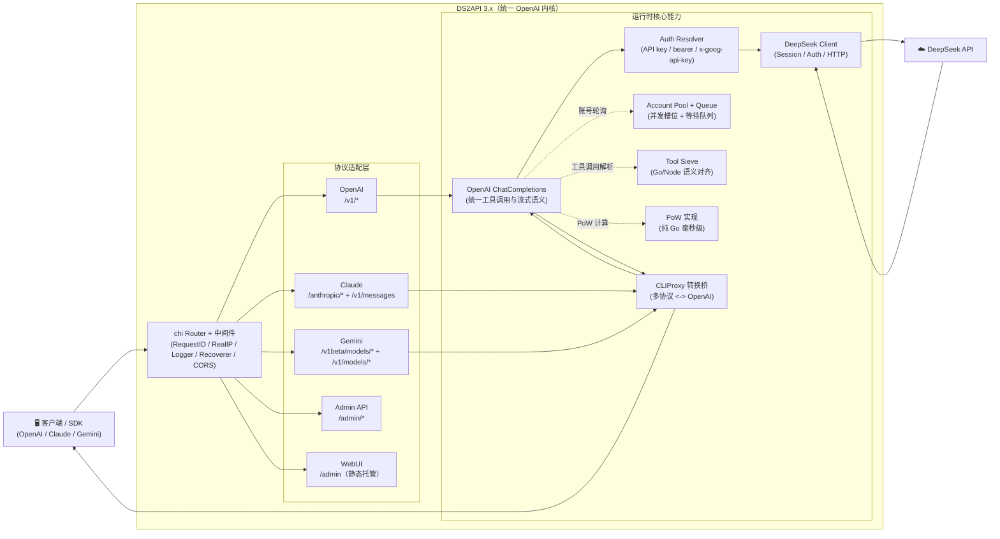

<!-- GitHub Trending: Go | 1,131 stars | +27 today -->

# CJackHwang/ds2api

> Deepseek to API - 客户端转API全栈开源工具，高性能，多账号轮询，支持纯vercel、docker部署使用。Google、Claude、ChatGPT多接口格式兼容

## Repository Info
- **URL**: https://github.com/CJackHwang/ds2api
- **Stars**: 1,131
- **Forks**: 379
- **Language**: Go
- **License**: GNU General Public License v3.0
- **Created**: 2026-01-21
- **Updated**: 2026-04-18
- **Topics**: api, deepseek, deepseek-api, deepseek-chat, docker, freeapi, go, proxy, proxy-server, react, vercel, vercel-deployment, zeabur
- **Open Issues**: 7

## README (excerpt)

  

# DS2API

语言 / Language: [中文](README.MD) | [English](README.en.md)

将 DeepSeek Web 对话能力转换为 OpenAI、Claude 与 Gemini 兼容 API。后端为 **Go 全量实现**，前端为 React WebUI 管理台（源码在 `webui/`，部署时自动构建到 `static/admin`）。

文档入口：[文档导航](docs/README.md) / [架构说明](docs/ARCHITECTURE.md) / [接口文档](API.md)

【感谢Linux.do社区及GitHub社区各位开发者对项目的支持与贡献】

> **重要免责声明**
>
> 本仓库仅供学习、研究、个人实验和内部验证使用，不提供任何形式的商业授权、适用性保证或结果保证。
>
> 作者及仓库维护者不对因使用、修改、分发、部署或依赖本项目而产生的任何直接或间接损失、账号封禁、数据丢失、法律风险或第三方索赔负责。
>
> 请勿将本项目用于违反服务条款、协议、法律法规或平台规则的场景。商业使用前请自行确认 `LICENSE`、相关协议以及你是否获得了作者的书面许可。

## 架构概览（摘要）

详细架构拆分与目录职责见 [docs/ARCHITECTURE.md](docs/ARCHITECTURE.md)。

- **后端**：Go（`cmd/ds2api/`、`api/`、`internal/`），不依赖 Python 运行时
- **前端**：React 管理台（`webui/`），运行时托管静态构建产物
- **部署**：本地运行、Docker、Vercel Serverless、Linux systemd

### 3.X 底层架构调整（相较旧版本）

- **统一路由内核**：所有协议入口统一汇聚到 `internal/server/router.go`，并在同一路由树中注册 OpenAI / Claude / Gemini / Admin / WebUI 路由，避免多入口行为漂移。
- **统一执行链路**：Claude / Gemini 入口先经 `internal/translatorcliproxy` 做协议转换，再进入 `openai.ChatCompletions` 统一处理工具调用与流式语义，最后再转换回原协议响应。
- **适配器分层更清晰**：`internal/adapter/{claude,gemini}` 负责入口/出口协议封装，`internal/adapter/openai` 负责核心执行，DeepSeek 侧调用只保留在 OpenAI 内核中。
- **Tool Calling 双运行时对齐**：Go 侧（`internal/toolcall`）与 Vercel Node 侧（`internal/js/helpers/stream-tool-sieve`）保持一致的解析/防泄漏语义，覆盖 JSON / XML / invoke / text-kv 多风格输入。
- **配置与运行时设置解耦**：静态配置（`config`）与运行时策略（`settings`）通过 Admin API 分离管理，支持热更新和密码轮换失效旧 JWT。
- **流式能力升级**：`/v1/responses` 与 `/v1/chat/completions` 共享更一致的工具调用增量输出策略，降低不同 SDK 下的行为差异。
- **可观测与可运维增强**：`/healthz`、`/readyz`、`/admin/version`、`/admin/dev/captures` 形成排障闭环，便于发布后验证。

## 核心能力

| 能力 | 说明 |
| --- | --- |
| OpenAI 兼容 | `GET /v1/models`、`GET /v1/models/{id}`、`POST /v1/chat/completions`、`POST /v1/responses`、`GET /v1/responses/{response_id}`、`POST /v1/embeddings` |
| Claude 兼容 | `GET /anthropic/v1/models`、`POST /anthropic/v1/messages`、`POST /anthropic/v1/