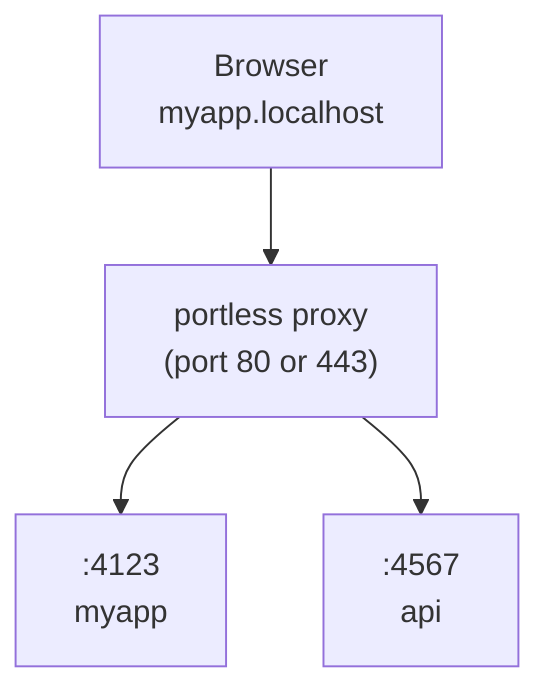

<!-- GitHub Trending: TypeScript | 7,184 stars | +45 today -->

# vercel-labs/portless

> Replace port numbers with stable, named local URLs. For humans and agents.

## Repository Info
- **URL**: https://github.com/vercel-labs/portless
- **Stars**: 7,185
- **Forks**: 227
- **Language**: TypeScript
- **License**: Apache License 2.0
- **Created**: 2026-02-15
- **Updated**: 2026-04-20
- **Topics**: N/A
- **Open Issues**: 43

## README (excerpt)
# portless

Replace port numbers with stable, named .localhost URLs for local development. For humans and agents.

```diff
- "dev": "next dev"                  # http://localhost:3000
+ "dev": "portless run next dev"     # https://myapp.localhost
```

## Install

**Global (recommended):**

```bash
npm install -g portless
```

**Or as a project dev dependency:**

```bash
npm install -D portless
```

> portless is pre-1.0. When installed per-project, different contributors may run different versions. The state directory format may change between releases, which can require re-running `portless trust`.

## Run your app

```bash
portless myapp next dev
# -> https://myapp.localhost
```

HTTPS with HTTP/2 is enabled by default. On first run, portless generates a local CA, trusts it, and binds port 443 (auto-elevates with sudo on macOS/Linux). Use `--no-tls` for plain HTTP.

The proxy auto-starts when you run an app. A random port (4000-4999) is assigned via the `PORT` environment variable. Most frameworks (Next.js, Express, Nuxt, etc.) respect this automatically. For frameworks that ignore `PORT` (Vite, VitePlus, Astro, React Router, Angular, Expo, React Native), portless auto-injects the right `--port` flag and, when needed, a matching `--host` flag.

When auto-starting, portless reuses the configuration (port, TLS, TLD) from the most recent proxy run, so a restart or reboot does not silently revert to defaults. Explicit env vars (`PORTLESS_PORT`, `PORTLESS_HTTPS`, etc.) always take priority.

In non-interactive environments (no TTY, or `CI=1`), portless exits with a descriptive error instead of prompting, so task runners like turborepo and CI scripts fail early with a clear message.

## Use in package.json

```json
{
  "scripts": {
    "dev": "portless run next dev"
  }
}
```

## Subdomains

Organize services with subdomains:

```bash
portless api.myapp pnpm start
# -> https://api.myapp.localhost

portless docs.myapp next dev
# -> https://docs.myapp.localhost
```

By default, only explicitly registered subdomains are routed (strict mode). Use `--wildcard` when starting the proxy to allow any subdomain of a registered route to fall back to that app (e.g. `tenant1.myapp.localhost` routes to the `myapp` app without extra registration).

## Git Worktrees

`portless run` automatically detects git worktrees. In a linked worktree, the branch name is prepended as a subdomain so each worktree gets its own URL without any config changes:

```bash
# Main worktree (no prefix)
portless run next dev   # -> https://myapp.localhost

# Linked worktree on branch "fix-ui"
portless run next dev   # -> https://fix-ui.myapp.localhost
```

Use `--name` to override the inferred base name while keeping the worktree prefix:

```bash
portless run --name myapp next dev   # -> https://fix-ui.myapp.localhost
```

Put `portless run` in your `package.json` once and it works everywhere. The main checkout uses the plain name, each worktree gets a unique subdomain. No collisions, no `--force`.

## Custom TLD

By default, portless uses `.localhost` which auto-resolves to `127.0.0.1` in most browsers. If you prefer a different TLD (e.g. `.test`), use `--tld`:

```bash
portless proxy start --tld test
portless myapp next dev
# -> https://myapp.test
```

The proxy auto-syncs `/etc/hosts` for route hostnames (including `.test`), so those domains resolve on your machine.

Recommended: `.test` (IANA-reserved, no collision risk). Avoid `.local` (conflicts with mDNS/Bonjour) and `.dev` (Google-owned, forces HTTPS via HSTS).

## How it works



1. **Start the proxy**: auto-starts when you run an app, or start explicitly with `portless proxy start`
2. **Run apps**: `portless <name> <command>` assigns a free port and registers with the proxy
3. **Acces