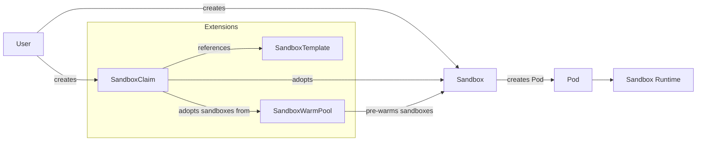

<!-- GitHub Trending: Go | 1,902 stars | +16 today -->

# kubernetes-sigs/agent-sandbox

> agent-sandbox enables easy management of isolated, stateful, singleton workloads, ideal for use cases like AI agent runtimes.

## Repository Info
- **URL**: https://github.com/kubernetes-sigs/agent-sandbox
- **Stars**: 1,902
- **Forks**: 213
- **Language**: Go
- **License**: Apache License 2.0
- **Created**: 2025-08-12
- **Updated**: 2026-04-23
- **Topics**: N/A
- **Open Issues**: 109

## README (excerpt)
<div align="center">
  

  <h1>Agent Sandbox</h1>
</div>


<p>
  <a href="https://github.com/kubernetes-sigs/agent-sandbox/releases"></a>
  <a href="LICENSE"></a>
  <a href="https://goreportcard.com/report/sigs.k8s.io/agent-sandbox"></a>
</p>

[Website](https://agent-sandbox.sigs.k8s.io) · [Docs](https://agent-sandbox.sigs.k8s.io/docs/) · [DeepWiki](https://deepwiki.com/kubernetes-sigs/agent-sandbox) · [Getting Started](https://agent-sandbox.sigs.k8s.io/docs/getting_started/) · [Examples](examples/) · [Roadmap](roadmap.md)

**agent-sandbox enables easy management of isolated, stateful, singleton workloads, ideal for use cases like AI agent runtimes.**

This project is developing a `Sandbox` Custom Resource Definition (CRD) and controller for Kubernetes, under the umbrella of [SIG Apps](https://github.com/kubernetes/community/tree/master/sig-apps). The goal is to provide a declarative, standardized API for managing workloads that require the characteristics of a long-running, stateful, singleton container with a stable identity, much like a lightweight, single-container VM experience built on Kubernetes primitives.

## Overview

### Core: Sandbox

The `Sandbox` CRD is the core of agent-sandbox. It provides a declarative API for managing a single, stateful pod with a stable identity and persistent storage. This is useful for workloads that don't fit well into the stateless, replicated model of Deployments or the numbered, stable model of StatefulSets.

Key features of the `Sandbox` CRD include:

*   **Stable Identity:** Each Sandbox has a stable hostname and network identity.
*   **Persistent Storage:** Sandboxes can be configured with persistent storage that survives restarts.
*   **Lifecycle Management:** The Sandbox controller manages the lifecycle of the pod, including creation, scheduled deletion, pausing and resuming.

### Extensions

The `extensions` module provides additional CRDs and controllers that build on the core `Sandbox` API to provide more advanced features.

*   `SandboxTemplate`: Provides a way to define reusable templates for creating Sandboxes, making it easier to manage large numbers of similar Sandboxes.
*   `SandboxClaim`: Allows users to create Sandboxes from a template, abstracting away the details of the underlying Sandbox configuration.
*   `SandboxWarmPool`: Manages a pool of pre-warmed Sandboxes that can be quickly allocated to users, reducing the time it takes to get a new Sandbox up and running.

## Architecture

agent-sandbox follows the Kubernetes controller pattern. Users create a Sandbox custom resource, and the controller manages the underlying runtime resources.

### Architecture Diagram



## Installation

### Core Components & Extensions

You can install the agent-sandbox controller and its CRDs with the following command.

```sh
# Replace "vX.Y.Z" with a specific version tag (e.g., "v0.1.0") from
# https://github.com/kubernetes-sigs/agent-sandbox/releases
export VERSION="vX.Y.Z"

# To install only the core