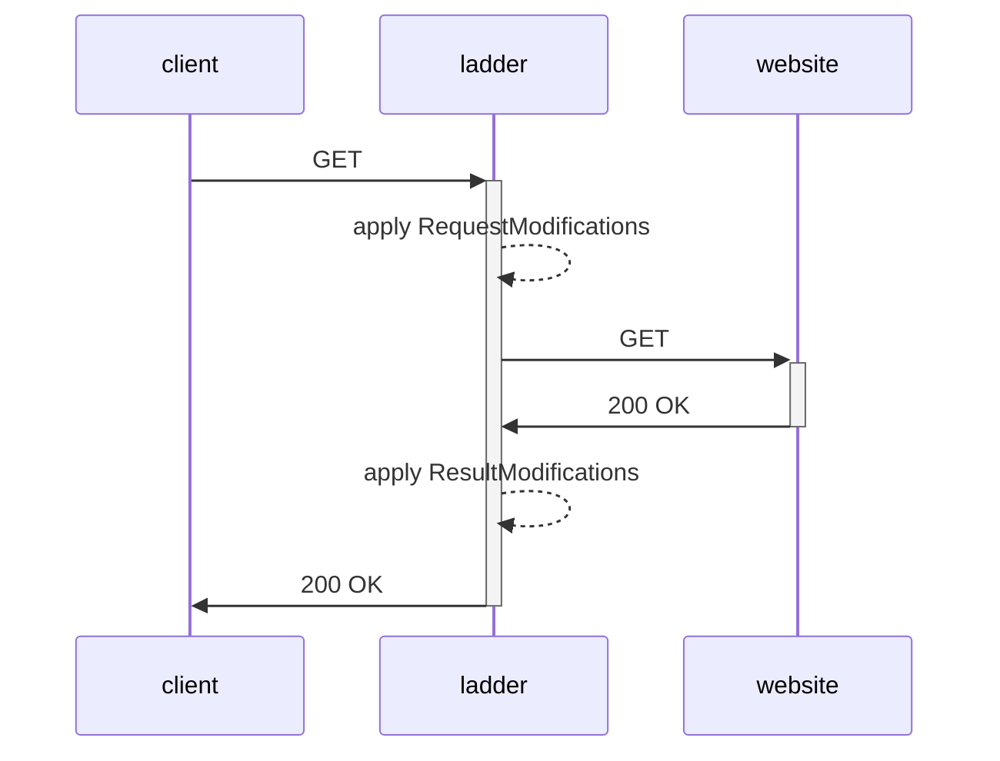

<!-- GitHub Trending: Go | 6,436 stars | +16 today -->

# everywall/ladder

> Selfhosted alternative to 12ft.io. and 1ft.io. Proxy to remove CORS headers and modify HTML

## Repository Info
- **URL**: https://github.com/everywall/ladder
- **Stars**: 6,436
- **Forks**: 301
- **Language**: Go
- **License**: GNU General Public License v3.0
- **Created**: 2023-11-01
- **Updated**: 2026-04-25
- **Topics**: bypass, cors, cors-proxy, paywall, paywall-blocker, paywall-bypasser
- **Open Issues**: 36

## README (excerpt)

    

<h1 align="center">Ladder</h1>

     

*Ladder is a http web proxy.* 

Ladder is a developer tool for testing and analyzing paywall implementations and content delivery behavior on modern websites.

It allows developers, researchers, and publishers to simulate different client environments (such as browsers and crawlers) and observe how content is served under varying conditions. This makes it useful for debugging paywall configurations, verifying access controls, http headers, and ensuring consistent behavior across different user agents.

Ladder is intended for legitimate testing, research, and quality assurance purposes only. It should only be used in compliance with applicable laws and the terms of service of the target website.

### How it works

### Features
- [x] Remove/modify CORS headers from responses, assets, and images ...
- [x] Remove/modify other headers (e.g. Content-Security-Policy)
- [x] Remove/inject custom code (HTML, CSS, JavaScript) into the page
- [x] Apply domain based ruleset/code to modify response / requested URL
- [x] Keep site browsable
- [x] API
- [x] Fetch RAW HTML
- [x] Custom User Agent
- [x] Custom X-Forwarded-For IP
- [x] [Docker container](https://github.com/everywall/ladder/pkgs/container/ladder) (amd64, arm64)
- [x] Linux binary
- [x] Mac OS binary
- [x] Windows binary (untested)
- [x] Basic Auth
- [x] Access logs
- [x] Might break tracking, adds and other 3rd party content
- [x] Limit the proxy to a list of domains
- [x] Expose Ruleset to other ladders
- [ ] Robots.txt testing
- [ ] Optional TOR proxy
- [ ] A key to share a proxied URL

### Limitations
Some websites deliver different content (Cloaking) depending on the type of client accessing them (for example, search engine crawlers versus standard web browsers). Ladder can be configured to emulate different client types in order to retrieve publicly accessible content for testing, automation, or research purposes.

However, many websites implement advanced mechanisms to restrict automated access, such as fingerprinting, rate limiting, or behavioral analysis. Ladder does not circumvent such protections and may not function correctly on services that actively restrict or control access.

Third-party tools such as FlareSolverr exist and may be used independently to render web pages in a headless browser environment. These tools are not part of Ladder, and their use may be subject to legal and contractual restrictions. Users are solely responsible for ensuring that their usage complies with all applicable regulations.

## Installation

> **Warning:** If your instance will be publicly accessible, make sure to enable Basic Auth. This will prevent unauthorized users from using your proxy. If you do not enable Basic Auth, anyone can use your proxy to browse nasty/illegal stuff. And you will be made responsible for it.

### Binary
1) Download binary [here](https://github.com/everywall/ladder/releases/latest)
2) Unpack and run the binary `./ladder -r https://raw.githubusercontent.com/everywall/ladder-rul