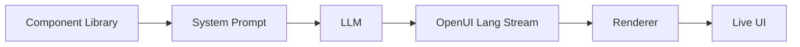

<!-- GitHub Trending: TypeScript | 4,281 stars | +195 today -->

# thesysdev/openui

> The Open Standard for Generative UI

## Repository Info
- **URL**: https://github.com/thesysdev/openui
- **Stars**: 4,282
- **Forks**: 279
- **Language**: TypeScript
- **License**: MIT License
- **Created**: 2024-12-02
- **Updated**: 2026-05-05
- **Topics**: agent, agents, ai, generative-ui, help-wanted, javascript, llm, looking-for-contributors
- **Open Issues**: 49

## README (excerpt)
<div align="center">


# OpenUI — The Open Standard for Generative UI

[](https://github.com/thesysdev/openui/actions/workflows/build-js.yml)
[](./LICENSE)
[](https://discord.com/invite/Pbv5PsqUSv)

<a href="https://trendshift.io/repositories/22357" target="_blank"></a>

</div>


OpenUI is a full-stack Generative UI framework — a compact streaming-first language, a React runtime with built-in component libraries, and ready-to-use chat interfaces — that is up to 67% more token-efficient than JSON.


---


[Docs](https://openui.com) · [Playground](https://www.openui.com/playground) · [Sample Chat App](./examples/openui-chat) · [Discord](https://discord.com/invite/Pbv5PsqUSv) · [Contributing](./CONTRIBUTING.md) · [Code of Conduct](./CODE_OF_CONDUCT.md) · [Security](./SECURITY.md) · [License](./LICENSE)


---

## What is OpenUI

<div align="center">


</div>

At the center of OpenUI is **OpenUI Lang**: a compact, streaming-first language for model-generated UI. Instead of treating model output as only text, OpenUI lets you define components, generate prompt instructions from that component library, and render structured UI as the model streams.

**Core capabilities:**

- **OpenUI Lang** — A compact language for structured UI generation designed for streaming output.
- **Built-in component libraries** — Charts, forms, tables, layouts, and more — ready to use or extend.
- **Prompt generation from your component library** — Generate model instructions directly from the components you allow.
- **Streaming renderer** — Parse and render model output progressively in React as tokens arrive.
- **Chat and app surfaces** - Use the same foundation for assistants, copilots, and broader interactive product flows.


## Quick Start

```bash
npx @openuidev/cli@latest create --name genui-chat-app
cd genui-chat-app
echo "OPENAI_API_KEY=sk-your-key-here" > .env
npm run dev
```

This is the fastest way to start with OpenUI. The scaffolded app gives you an end-to-end starting point with streaming, built-in UI, and OpenUI Lang support.

What this gives you:

- **OpenUI Lang support** - Start with structured UI generation built into the app flow.
- **Library-driven prompts** - Generate instructions from your allowed component set.
- **Streaming support** - Update the UI progressively as output arrives.
- **Working app foundation** - Start from a ready-to-run example instead of wiring everything manually.


## How it works

Your components define what the model can generate.



1. Define or reuse a component library.
2. Generate a system prompt from that library.
3. Send that prompt to your model.
4. Stream OpenUI Lang output back to the client.
5. Render the output progressively with Renderer.

Try it yourself in the [Playground](https://www.openui.com/playground) — generate UI live with the default component library.

## Packages

| Package | Description |
| :--- | :--- |
| [`@openuidev/react-lang`](./packages/react-lang) | Core runtime — component definitions, parser, renderer, prompt generation |
| [`@openuidev/react-headless`](./packages/react-headless) | Headless chat state, streaming adapters, message format converters |
| [`@openuidev/react-ui`](./packages/react-ui) | Prebuilt chat layouts and two built-in component librar