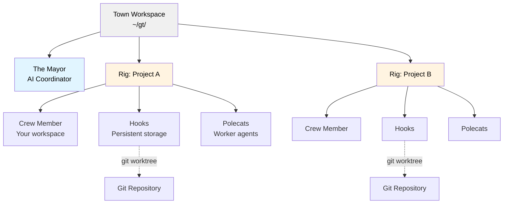

<!-- GitHub Trending: Go | 15,242 stars | +36 today -->

# gastownhall/gastown

> Gas Town - multi-agent workspace manager

## Repository Info
- **URL**: https://github.com/gastownhall/gastown
- **Stars**: 15,242
- **Forks**: 1,412
- **Language**: Go
- **License**: MIT License
- **Created**: 2025-12-16
- **Updated**: 2026-05-16
- **Topics**: N/A
- **Open Issues**: 168

## README (excerpt)
# Gas Town

**Multi-agent orchestration system for Claude Code, GitHub Copilot, and other AI agents with persistent work tracking**

## Overview

Gas Town is a workspace manager that lets you coordinate multiple AI coding agents (Claude Code, GitHub Copilot, Codex, Gemini, and others) working on different tasks. Instead of losing context when agents restart, Gas Town persists work state in git-backed hooks, enabling reliable multi-agent workflows.

### What Problem Does This Solve?

| Challenge                       | Gas Town Solution                            |
| ------------------------------- | -------------------------------------------- |
| Agents lose context on restart  | Work persists in git-backed hooks            |
| Manual agent coordination       | Built-in mailboxes, identities, and handoffs |
| 4-10 agents become chaotic      | Scale comfortably to 20-30 agents            |
| Work state lost in agent memory | Work state stored in Beads ledger            |

### Architecture

## Core Concepts

### The Mayor 🎩

Your primary AI coordinator. The Mayor is a Claude Code instance with full context about your workspace, projects, and agents. **Start here** - just tell the Mayor what you want to accomplish.

### Town 🏘️

Your workspace directory (e.g., `~/gt/`). Contains all projects, agents, and configuration.

### Rigs 🏗️

Project containers. Each rig wraps a git repository and manages its associated agents.

### Crew Members 👤

Your personal workspace within a rig. Where you do hands-on work.

### Polecats 🦨

Worker agents with persistent identity but ephemeral sessions. Spawned for tasks, sessions end on completion, but identity and work history persist.

### Hooks 🪝

Git worktree-based persistent storage for agent work. Survives crashes and restarts.

### Convoys 🚚

Work tracking units. Bundle multiple beads that get assigned to agents. Convoys labeled `mountain` get autonomous stall detection and smart skip logic for epic-scale execution.

### Beads Integration 📿

Git-backed issue tracking system that stores work state as structured data.

**Bead IDs** (also called **issue IDs**) use a prefix + 5-character alphanumeric format (e.g., `gt-abc12`, `hq-x7k2m`). The prefix indicates the item's origin or rig. Commands like `gt sling` and `gt convoy` accept these IDs to reference specific work items. The terms "bead" and "issue" are used interchangeably—beads are the underlying data format, while issues are the work items stored as beads.

### Molecules 🧬

Workflow templates that coordinate multi-step work. Formulas (TOML definitions) are instantiated as molecules with tracked steps. Two modes: root-only wisps (steps materialized at runtime, lightweight) and poured wisps (steps materialized as sub-wisps with checkpoint recovery). See [Molecules](docs/concepts/molecules.md).

### Monitoring: Witness, Deacon, Dogs 🐕

A three-tier watchdog system keeps agents healthy:

- **Witness** - Per-rig lifecycle manager. Monitors polecats, detects stuck agents, triggers recovery, manages session cleanup.
- **Deacon** - Background supervisor running continuous patrol cycles across all rigs.
- **Dogs** - Infrastructure workers dispatched by the Deacon for maintenance tasks (e.g., Boot for triage).

### Refinery 🏭

Per-rig merg