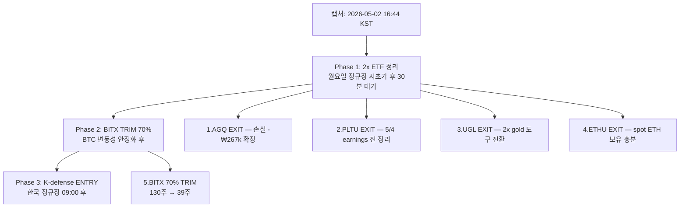

# Asset Cleanup Plan — Manual Execution Guide (2026-05-02)

> **목적**: Quanty Top-3 actions + thesis Top-3 actions를 의장이 Toss·Upbit 앱에서 단계별로 실행할 수 있도록, **종목별 매도 절차·호가·주문 종류**를 가이드.
>
> **하드 룰**:
> 1. 본 문서는 **거래 명령이 아니다**. 의장이 직접 앱에서 입력.
> 2. 미국 주식 = 정규장 22:30~05:00 KST (서머타임). pre-market·after-hours 주문 시 **유동성 위험** 명시.
> 3. 호가는 **실시간 spread** 확인 후 결정. 본 가이드의 "권장 호가"는 캡처 시점 기준 reference.
> 4. **각 단계 실행 후 스크린샷 보관** — 의장 거래 일지 룰.

---

## 0. Execution Order — 우선순위



| # | 액션 | 종목 | 현재 수량 | 목표 수량 | 처분 수량 | 우선순위 사유 |
|---|---|---|---|---|---|---|
| 1 | EXIT | AGQ | 15 | 0 | 15 | Rule #5 위반 (2x 1개월 초과 의심) + Rule #6 (SIL 중복 thesis) |
| 2 | EXIT | PLTU | 20 | 0 | 20 | 5/4 PLTR earnings 전 정리. ±21% binary risk |
| 3 | EXIT | UGL | 7 | 0 | 7 | 2x gold 도구 → spot IAU/GLD 으로 전환 권장 |
| 4 | EXIT | ETHU | 40 | 0 | 40 | spot ETH (Upbit 0.869 ETH) 이미 보유 → 중복 |
| 5 | TRIM | BITX | 130 | 39 | 91 | 2x daily reset Rule #5; 30% 잔류로 BTC tactical 유지 |
| 6 | (선택) ENTRY | TIGER 200 방산우주 (462330) | 0 | TBD | — | KR exposure 0.7% → 4-5%로 확장. Phase 3에서 별도 결정 |

> **합계 회수금 예상**: AGQ ₩2.48M + PLTU ₩1.17M + UGL ₩604k + ETHU ₩1.49M + BITX 70% ₩2.50M ≈ **₩8.25M cash 회수**

---

## 1. AGQ EXIT — ProShares Ultra Silver (15qty)

### 사실
- 보유: 15주 @ avg ₩182,926 = 평가액 ₩2,476,650
- 미실현 손익: -₩267,245 (-9.7%)
- 도구: 2x daily silver leveraged ETF (vol drag 누적)
- 시장: NYSE Arca, 정규장 22:30~05:00 KST

### 권장 주문
| 항목 | 값 |
|---|---|
| 주문 종류 | **지정가 (Limit)** — 시장가 금지 (spread 큼) |
| 권장 호가 | bid 가격 + $0.05 (즉시 체결 우선) |
| 타이밍 | **정규장 시작 30분 후 ~ 마감 1시간 전** (유동성 충분 구간) |
| 분할 매도 | 5주씩 3회 (slippage 최소화) — 또는 전량 일괄 (얕은 호가일 때) |

### Toss UI 단계
```
1. Toss 앱 → 주식 → 보유 종목 → AGQ 선택
2. [매도] 버튼 탭
3. 주문 종류: [지정가] 선택 (기본 [시장가] 변경 필수)
4. 수량: 15
5. 가격: 실시간 호가창 확인 → 매수 호가 + $0.05
6. [확인] → 주문 미리보기 화면
7. ⚠️ 체크리스트:
   ☐ 종목명 AGQ 맞음
   ☐ 매도/매수 [매도] 맞음
   ☐ 수량 15
   ☐ 가격 spread 합리적 ($0.50 이내)
   ☐ 평가 손실 ≈ -₩267k 예상
8. [주문] 탭 → 비밀번호/지문
9. 체결 알림 확인 → 스크린샷 저장
```

### 손절 사유 (의장 일지용)
> AGQ는 2x 레버리지 도구로 entry 자체가 잘못된 선택. 은 thesis (gold/silver ratio 64 → 60 정상화) 는 유효하나, 도구를 SIL(1x miner) 또는 SLV(spot) 으로 갈아타기. 손실 -₩267k = "수업료" — Rule #5 학습 비용.

---

## 2. PLTU EXIT — T-Rex 2x Long Palantir (20qty)

### 사실
- 보유: 20주 @ avg ₩66,427 = 평가액 ₩1,170,145
- 미실현 손익: -₩158,384 (-13.5%)
- **5/4 PLTR Q1 2026 earnings** — binary event (±21% PLTU 예상)
- 도구: 2x daily PLTR

### 권장 주문
| 항목 | 값 |
|---|---|
| 주문 종류 | **지정가 (Limit)** |
| 권장 호가 | bid + $0.03 |
| 타이밍 | **5/2 (금) 마감 전 또는 5/4 (월) 시초가** — earnings 5/4 장마감 후 발표 → **월요일 정규장 마감 전 필수 청산** |
| 분할 매도 | 10주 × 2회 (PLTU는 박스 거래 폭 큼) |

### Toss UI 단계
```
1. Toss → 주식 → PLTU
2. [매도] → [지정가]
3. 수량: 20
4. 가격: 매수 호가 + $0.03
5. ⚠️ 체크리스트:
   ☐ 5/4 (월) 17:00 KST 이전 주문 완료 (정규장 마감 전)
   ☐ 5/4 PLTR earnings = 장마감 후 발표 → afterhours 격변동
   ☐ 절대 hold-through-earnings 금지 (도박)
6. [주문] → 체결 확인 → 스크린샷
```

### 대안: 1x로 thesis 유지
PLTR thesis (avg target $191, +35% upside) 가 valid 하다고 판단하면, PLTU 청산금으로 **PLTR spot 1주** ($141 가정) 매수. 같은 thesis · 1x · vol drag 없음.

---

## 3. UGL EXIT — ProShares Ultra Gold (7qty)

### 사실
- 보유: 7주 @ avg ₩95,273 = 평가액 ₩603,949
- 미실현 손익: -₩62,965 (-9.4%)
- 도구: 2x daily gold leveraged ETF

### 권장 주문
| 항목 | 값 |
|---|---|
| 주문 종류 | **지정가** |
| 권장 호가 | bid + $0.10 (UGL spread 더 큼) |
| 타이밍 | 정규장 23:00 KST 이후 (NY 09:30 open 후 충분 안정화) |
| 분할 매도 | 7주 일괄 (작은 사이즈) |

### Toss UI 단계
```
1. Toss → 주식 → UGL
2. [매도] → [지정가] → 수량 7 → 가격 입력
3. ⚠️ UGL은 거래량 적음 → 호가 spread 0.5% 이상이면 1$ 더 낮춰 입력
4. [주문] → 체결 확인 → 스크린샷
```

### 대안: gold thesis 유지
회수금 ₩540k → spot **IAU** (iShares Gold Trust, 1x, fee 0.25%) 약 9~10주 매수. 또는 **GLD** (SPDR Gold) 약 1.5주.

---

## 4. ETHU EXIT — 2x Ether ETF (40qty)

### 사실
- 보유: 40주 @ avg ₩41,991 = 평가액 ₩1,494,208
- 미실현 손익: -₩185,450 (-12.4%)
- **이미 spot ETH 보유** (Upbit 0.869 ETH @ avg ₩3,452,261, -1%) → 중복 익스포저

### 권장 주문
| 항목 | 값 |
|---|---|
| 주문 종류 | **지정가** |
| 권장 호가 | bid + $0.05 |
| 타이밍 | 정규장 시작 30분 후 |
| 분할 매도 | 20주 × 2회 (slippage 분산) |

### Toss UI 단계
```
1. Toss → 주식 → ETHU
2. [매도] → [지정가] → 수량 20 → 가격 입력
3. 체결 확인 후 → 두 번째 20주 동일하게
4. ⚠️ 체크리스트:
   ☐ Upbit ETH 0.869 ETH 보유 중 (별도 자산)
   ☐ ETHU 청산 = ETH thesis 포기 X, 도구만 변경
5. 회수금 ₩1.31M 옵션:
   (a) Upbit ETH 추가 매수 (₩3.4M/ETH 가정 → 0.39 ETH 추가)
   (b) Cash 보관 (5/4 PLTR earnings 후 진입 기회 대기)
```

---

## 5. BITX 70% TRIM — 2x Bitcoin Strategy ETF (130qty → 39qty)

### 사실
- 보유: **130주** @ avg ₩27,934 = 평가액 ₩3,577,427
- 미실현 손익: -₩53,989 (-1.5%)
- 도구: 2x daily BTC leveraged ETF
- 처분 수량: **91주** (70%) → 잔류 39주

### 권장 주문 (분할 매도 필수)
| 항목 | 값 |
|---|---|
| 주문 종류 | **지정가** (130주 큰 사이즈) |
| 권장 호가 | bid + $0.02 |
| 타이밍 | BTC 일중 변동 ±2% 이내 안정화 구간 (BTC 차트 확인 후) |
| 분할 매도 | **30주 × 3회** = 90주, 마지막 1주 따로 (총 91주) |
| 잔류 39주 사유 | tactical BTC long (BTC 새 ATH 시도 시 short-term play 옵션 보존) |

### Toss UI 단계
```
1. BTC 가격 안정 확인 (CoinGecko BTC 24h chart, ±2% 이내)
2. Toss → 주식 → BITX
3. [매도] → [지정가] → 수량 30 → 가격: bid + $0.02
4. 첫 번째 30주 체결 → 스크린샷
5. 5분 대기 후 두 번째 30주 (호가 재확인)
6. 세 번째 30주 동일
7. 마지막 1주: 시장가 OK (잔수 정리)
8. ⚠️ 체크리스트:
   ☐ 잔류 39주 = ₩1.09M (소액 tactical 유지)
   ☐ 회수금 ₩2.50M = cash → spot BTC 또는 IBIT (iShares Bitcoin) 옵션
   ☐ Rule #5 (2x 1개월 초과) 회피 — 잔류분도 30일 timer 시작
```

### Action 후 BITX 잔류 39주 운명
- **Option A**: 30일 안에 tactical close (Rule #5 준수) — BTC 단기 상승 catch 후 청산
- **Option B**: 잔류 39주도 spot IBIT 으로 갈아타기 (vol drag 회피)
- 의장 결정 사항. 본 가이드는 70% 청산까지만.

---

## 6. (선택) K-defense ENTRY — TIGER 200 방산우주 (462330)

> Track 1 핵심은 **EXIT/TRIM 5건**. K-defense entry는 회수금 ₩8.25M 의 일부 재배치 옵션 — 의장 별도 판단.

### Reference (의장 결정용)
- ETF: TIGER 200 방산우주 ETF (462330) — 한화에어로스페이스 30%, KAI 18%, LIG넥스원 13% 등
- 또는: 한화에어로스페이스 (012450) 직접
- 사유: 4대 방산 2026 OP 5.2조→7.5조 (+44% YoY), 의장 KR 노출 0.7%만
- 사이즈 추천: 회수금 ₩8.25M 중 ₩2~3M (총 자산 3~5%) — 단계적 진입

### Toss UI 단계 (옵션 실행 시)
```
1. Toss → 검색 → "TIGER 200 방산우주" 또는 462330
2. [매수] → [지정가] (KOSPI는 호가 단위 작음 — 5원 단위)
3. KR 정규장 09:00~15:30 KST
4. 1차 진입: 50% 사이즈만 (분할 진입 원칙)
5. 2차 진입은 1~2주 후 차트 안정 확인 후
```

> **K-defense 진입은 의장 직접 판단 필요** — 본 plan에는 권장만 명시, 자동 실행 X.

---

## 7. 체크리스트 — 의장 실행 전 확인

### Pre-execution (월요일 시작 전)
- [ ] BTC 24h 가격 확인 (BITX trim 타이밍 영향)
- [ ] PLTR 5/4 earnings 일정 재확인 (PLTU 청산 deadline)
- [ ] Toss 앱 로그인 + 잔액 확인
- [ ] 본 cleanup plan + Quanty + thesis 3개 문서 동시 오픈

### During execution
- [ ] 각 주문 직전 실시간 호가창 확인 (본 가이드 reference 가격 재검증)
- [ ] 지정가 주문 입력 후 [확인] 화면에서 종목·수량·매도/매수 3중 체크
- [ ] 체결 후 즉시 스크린샷 저장 (Files: `~/Thairon/obsidian-vault/Projects/y-Holdings/Asset/portfolio/screenshots/2026-05-XX/`)

### Post-execution
- [ ] 회수금 합계 ≈ ₩8.25M 일치 확인
- [ ] 5/3 (화) snapshot 생성: `portfolio/2026-05-03-snapshot.md`
- [ ] 잔류 BITX 39주 = 30일 timer 시작 (`5/2 + 30 = 6/1` 까지 청산 deadline)
- [ ] 손익 일지: AGQ -₩267k / PLTU -₩158k / UGL -₩63k / ETHU -₩185k = **실현손실 -₩673k 확정**

---

## 8. Risk / Failure modes

| 위험 | 발생 시 대응 |
|---|---|
| 정규장 갭하락 (월요일 -3% 이상) | 시초가 30분 대기 → 안정화 확인 후 진입. 패닉 매도 금지. |
| BITX 청산 중 BTC 급등 (+5%) | 잔류 39주가 보존되므로 일부 회복. 90주 청산은 계획대로. |
| PLTU 5/3~5/4 갭상승 (+10%) | -₩50k 회복 — 그래도 청산. earnings hold = 도박, 룰 위반. |
| Toss 주문 거부 (시장 외) | 재시도 또는 다음 정규장 대기. 임의 가격 변경 금지. |
| 호가 spread 1% 이상 | 분할 매도 3회 → 5회로 확대. 시장가 금지. |

---

## 9. 의장 결재 항목 (실행 전 최종 확인)

```
□ AGQ EXIT 15주 (예상 회수 ₩2.48M, 실현손 -₩267k)
□ PLTU EXIT 20주 (예상 회수 ₩1.17M, 실현손 -₩158k)  [5/4 deadline]
□ UGL EXIT 7주 (예상 회수 ₩604k, 실현손 -₩63k)
□ ETHU EXIT 40주 (예상 회수 ₩1.49M, 실현손 -₩185k)
□ BITX TRIM 91주 (예상 회수 ₩2.50M, 실현손 -₩38k 추정)
─────────────────────────────────────────────
합계 5종목, 회수금 ₩8.25M, 실현손 -₩711k

□ 회수금 재배치:
  - cash 보관 (₩4M)
  - K-defense entry (₩2.5M, 옵션)
  - SIL 추가 (₩1M, 옵션)
  - spot crypto/IBIT (₩750k, 옵션)
```

> **본 plan은 의장 manual execution을 위한 가이드. 자동 거래 명령 없음. 실행 책임은 의장.**

---

## Sources

- Quanty P/EV/Kelly: `quanty-pevkelly-2026-05-02.md` §2 Top 3 Active Fixes
- Thesis: `thesis-full-coverage-2026-05-02.md` §0 Top 3 Urgent Actions, §1.5 (AGQ), §1.7 (PLTU)
- Snapshot: `portfolio/2026-05-02-snapshot.md` (qty/avg_price 출처)
- Asset rules: `asset_trader_rules_8_to_11.md` (Rule #5 2x ETF 1개월), `asset_rule_12_probabilistic.md`
- Korean defense ETF: TIGER 200 방산우주 (462330) [Mirae Asset](https://www.tigeretf.com)
- IBIT (BlackRock spot BTC): [iShares Bitcoin Trust](https://www.ishares.com/us/products/333011/ishares-bitcoin-trust)
- IAU (iShares Gold): [iShares Gold Trust](https://www.ishares.com/us/products/239561/ishares-gold-trust-fund)
