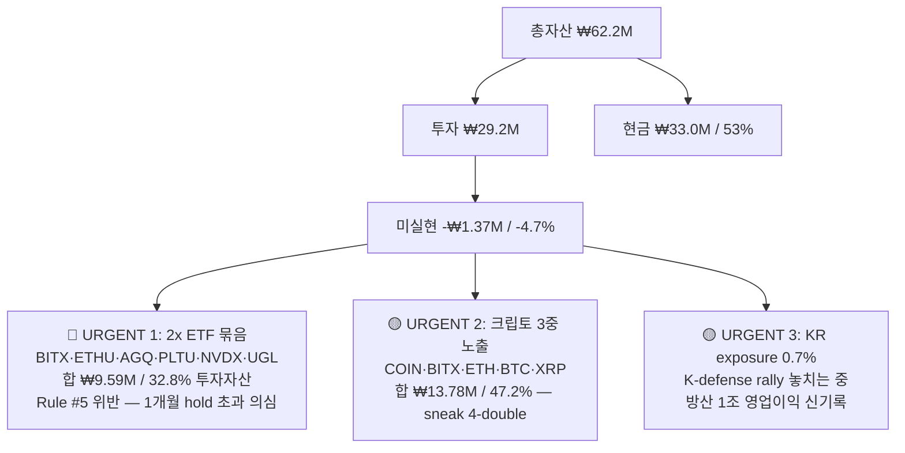
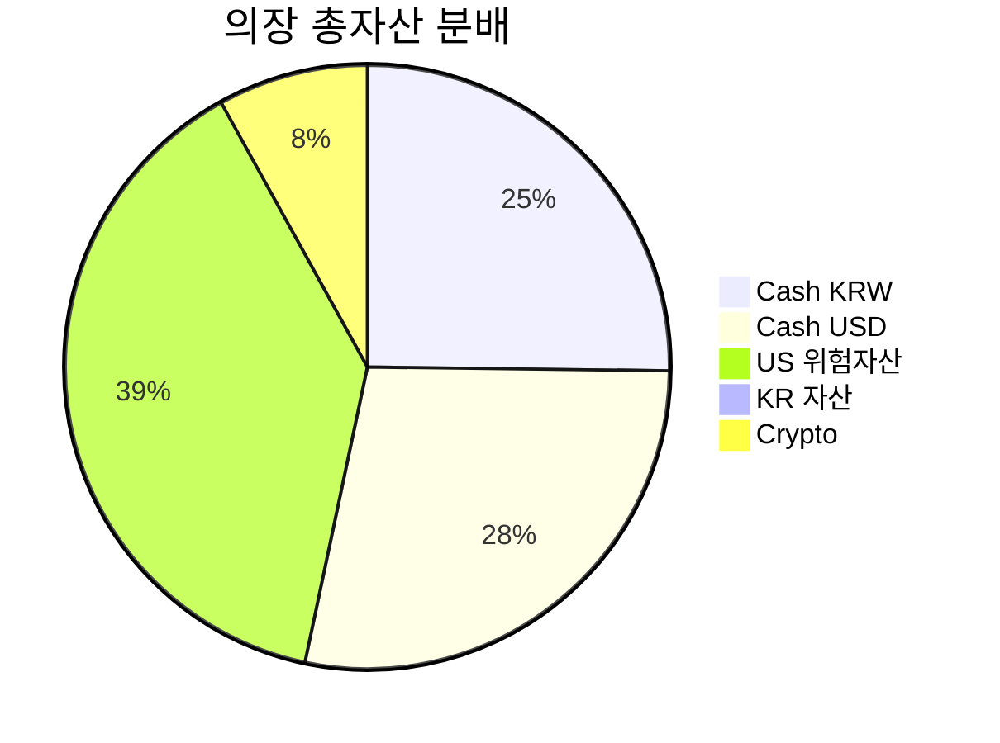

# Asset Thesis Full Coverage — 2026-05-02

> **Asset 페르소나의 역할 재정의** (의장 지시 2026-05-02)
> "전문트레이더로서 가르쳐주고 가이드해주는게 Asset의 역할이야."
>
> 본 보고서는 단순 종목 brief 아님. 각 포지션을 (1) 사실 → (2) 룰 → (3) 액션
> 3단 구조로 풀어, 의장이 패턴을 학습 후 다음 거래에 자율 적용 가능하도록 설계.

---

## 0. Executive Summary — Top 3 Urgent Actions



| # | Action | 사유 | 의장 manual 단계 |
|---|---|---|---|
| 1 | **2x ETF 묶음 단계 축소** (BITX/ETHU/AGQ/PLTU 우선) | Rule #5 1개월 초과 시 vol drag 확정. Morningstar 2009-2018 2x ETF 평균 -11.1% vs underlying +15.7% | Toss → 30% 청산 → cash 회수 → spot ETF (IBIT/SLV/PLTR)로 갈아타기 검토 |
| 2 | **암호화 노출 정리** | BTC·SPX 60-day correlation 0.74 (5-yr 평균 0.30) — 분산 효과 X. 4-way 동일 베팅. | COIN 또는 BITX 둘 중 하나만 유지 |
| 3 | **KR 방산 ETF 또는 한화에어로스페이스 신규 진입 검토** | 4대 방산 2026 OP +44% YoY (5.2조→7.5조). 의장 KR 노출 0.7%만 → Korean alpha 누락 | TIGER 200 방산우주 (462330) 또는 한화에어로스페이스(012450) 직접 |

---

## 1. Holdings Thesis (개별)

> 이미 Cap에서 다룬 COIN과 2x ETF 묶음(BITX/ETHU/PLTU/AGQ/NVDX/UGL)은 **fresh web data로 업데이트 + 룰 재강조**.

### 1-1. COIN (Coinbase Global) — 15qty @ $221.46 → -₩397k

**Web 사실 (2026-05-01)**:
- 현재가 ~$187 (의장 진입가 $221.46 대비 **약 -15.5% 손실**)
- Q1 2026 earnings **5/7 발표 예정** ([IG, 2026-04-30](https://www.ig.com/en/news-and-trade-ideas/coinbase-1Q26-earnings-preview1-260430))
- 글로벌 crypto 거래대금 March 2026 $4.3T — 2025-10 peak 대비 **-48%**
- 2026 EPS consensus Q4 결과 후 -49% 하향
- Median 12M target $227 (51 analysts) — 현재가 대비 +21% 상승 여지
- Wedbush Dan Ives Outperform $230, 27 analysts Buy 컨센

**Trader's Read**:
- 의장 진입가 $221 = 2025-Q4 high 대비 -34% 한참 빠진 자리에서 잡았으나, 거래대금 -48% 빠지는 구조적 압박이 EPS를 갉아먹는 중. 5/7 earnings 가 hard catalyst.
- BTC와 80%+ 동조 — COIN 단독 thesis는 BTC bull thesis와 분리 불가.
- **5/7 ±10% post-earnings move** options pricing.

**Rule** (재강조): Rule #4 — thesis 무효화 시그널 사전 정의. COIN의 무효화 = (a) Q1 earnings miss + 가이던스 컷 (b) BTC $75k 이탈 (c) 규제 negative surprise.

**Action**: **HOLD through 5/7 earnings**. 그 전 20% pre-earnings cut은 바보. earnings 후 (a) beat + raise → 추가 trim 안 함, (b) miss → -10% 즉시 손절 후 spot BTC ETF (IBIT) 로 thesis 옮기기.

Sources: [Public.com COIN Forecast](https://public.com/stocks/coin/forecast-price-target), [Coingape](https://coingape.com/markets/coin-stock-price-prediction-may-2026-as-lawsuits-weigh-on-pre-earnings-outlook/), [IG Q1 Preview](https://www.ig.com/en/news-and-trade-ideas/coinbase-1Q26-earnings-preview1-260430)

---

### 1-2. OIH (VanEck Oil Services ETF) — 5qty @ $450 → +₩195k (유일한 winner)

**Web 사실 (2026-05-01)**:
- 현재가 $442.60 (의장 +6%)
- 52w range $209.02 – $450.85 — **52w high 부근**
- AUM $2.50B, P/E 25.9, 30-day yield 1.12%
- Top holdings: **SLB 20.12%** / Baker Hughes 11.89% / Halliburton 6.77%
- SLB Q1 2026 매출 $8.72B (+3% YoY), 순익 -6% — **중동 disruption** 마진 압박
- 단·장기 MA 모두 buy signal
- Brent $126/bbl, WTI $110 (geopolitical 기인) — 2026 평균은 $77.50 추정

**Trader's Read**:
- 의장 단 5주만 보유한 게 결정적. **포지션 싸이즈가 작은 winner는 winner가 아님** — 자본배분 실수 (small concentration in the only thing that worked).
- OIH = SLB 20% 비중. SLB Q1 mix는 mid-east disruption 부정적. 그러나 oil price spike (Brent $126) 가 service 수요 견인.
- 52w high 근처 → mean-reversion risk + Brent 정상화 (→$77.50) 시 service 수요 normalize.

**Rule (신규 #8 후보)**: **"오직 winner는 사이즈가 작아서 결과적으로 무의미해지는 경우가 있다."** 의장 OIH=$2,250 (5주). 만약 진입 시 대신 30주($13,500) 했더라면 +₩1.17M 이익. 다음 high-conviction 진입 시 **conviction-sizing rule** 필요.

**Action**: **TRIM 2주 → 3주만 유지** (52w high mean-reversion 대비). 회수금 ₩1.3M는 K-defense or KR 리츠로 재배치. 또는 SLB Q2 가이던스 확인 후 3주 → 8주로 doubled-down (with conviction).

Sources: [VanEck OIH](https://www.vaneck.com/us/en/investments/oil-services-etf-oih/), [SLB Q1 2026](https://www.sci-tech-today.com/news/slb-q1-2026-earnings/), [IndexBox SLB](https://www.indexbox.io/blog/slb-reports-q1-2026-financial-results-revenue-up-3-to-872bn-net-income-down-6/)

---

### 1-3. XLE (Energy Select Sector SPDR) — 30qty @ $65.80 → -₩83k

**Web 사실 (2026-05-01)**:
- 현재가 $58.44 (의장 진입 $65.80 대비 **-11%**)
- Brent $126 / WTI $110 — 가격은 spike, but XLE는 **하락**
- Goldman 2026 평균 Brent $77.50 (이전 $61에서 상향)

**Trader's Read**:
- 이상 신호: **유가는 spike ($126) 인데 XLE는 -11%** → 시장이 "현재 spike는 일시적 (geopolitical), 정상화하면 기업 capex 안 늘림" 으로 가격에 반영.
- OIH (+6%) vs XLE (-11%) divergence = oil **service** vs **producer** 갭. 서비스 = capex spending; producer = output price. 현 cycle은 geopolitical 으로 producer는 의심 받는 중.
- Rule #6 위반: OIH + XLE 둘 다 같은 thesis(에너지 long). **통합 익스포저 ₩5.94M = 투자자산 20.4%** — Rule #1(섹터 15%) **위반**.

**Rule (재강조 #1, #6)**: 섹터 15% cap 위반. 둘 중 하나는 정리.

**Action**: **XLE 전량 청산 (-11% 손실 확정)**. 회수금 ₩2.64M → OIH 보유 + 신규 K-defense / 채권으로. 손절 사유: thesis 약화 (capex 감소 우려) + 섹터 over-allocation. 손절은 부끄러운 게 아님 — 룰 준수가 중요.

Sources: [SSGA XLE](https://www.ssga.com/us/en/intermediary/etfs/state-street-energy-select-sector-spdr-etf-xle), [XLE stockanalysis](https://stockanalysis.com/etf/xle/)

---

### 1-4. SIL (Global X Silver Miners) — 20qty @ $100.27 → -₩145k

**Web 사실 (2026-04-27)**:
- 현재가 $93.80 (의장 -6.4%)
- 52w $38.59 – $119.24
- 28 Buy / 10 Hold / 0 Sell, **avg 12M target $128.29 (+37%)**
- 단기 (3M) 예상: -4.46% / 90% 신뢰구간 $75 – $111
- 은가 $73/oz (April), 1월 peak $95 대비 **-22%**
- gold/silver ratio 64 vs 역사 평균 55-60 — silver 저평가

**Trader's Read**:
- SIL = silver miner 익스포저 (vol amplifier). 은 자체가 -22% 빠진 자리에서 SIL은 -6%만 빠짐 → 광부 종목이 메탈보다 덜 빠짐 = bullish divergence.
- gold/silver 비율 64 → 정상화 (60→55) 시 silver outperform 큰 baseline.
- 12개월 컨센서스 +37% upside.
- Rule #6: AGQ(2x silver) + SIL = 같은 thesis 중복. **합 ₩5.10M (17.5%)** — Rule #1 섹터 15% **위반**.

**Rule (재강조 #5, #6)**: AGQ(레버리지) + SIL(광부 베타) = same thesis double. AGQ만 정리 → SIL 단독으로 light thesis 유지가 정도.

**Action**: **AGQ 전량 정리 + SIL 보유** (또는 AGQ 정리 후 SIL 5주 추가). 12M target $128 + supply deficit 4년 연속 thesis 유효. 무효화 = 은가 $65 이탈 + Fed 매파 전환.

Sources: [Global X SIL](https://www.globalxetfs.com/funds/sil), [Seeking Alpha SIL](https://seekingalpha.com/article/4855332-global-x-silver-miners-etf-leveraged-exposure-to-silver-as-the-cycle-extends-into-2026), [TipRanks SIL Forecast](https://www.tipranks.com/etf/sil/forecast)

---

### 1-5. AGQ (ProShares Ultra Silver, 2x) — 15qty @ $132.55 → -₩267k

**Web 사실**:
- ProShares Ultra Silver. 2x daily silver. **vol drag = severe**.
- Morningstar 2009-2018: 2x leveraged ETF 평균 **연 -11.1%** vs underlying +15.7%

**Trader's Read**:
- 의장 진입 시점 = 은가 1월 peak 직후 ($95), 현재 $73 → 은가 -23%. AGQ는 -267k / ₩2.74M = **-9.7%** (2x이면 -46% 예상이었으나 vol drag 흡수).
- **Rule #5 위반 명백**: 2x ETF max 1개월. 의장 진입일 미상이지만 손실 -₩267k = vol drag 누적 신호.

**Rule (재강조 #5)**: 2x 레버리지 = single-day tactical only. 1개월 초과 hold = vol drag 보장.

**Action**: **즉시 정리**. 청산금 ₩2.48M → SIL에 일부 + spot SLV ETF로 이전. 은 thesis는 유효하나, 도구 선택 (2x ETF) 이 잘못. 손절 -₩267k는 "수업료" 로 회계.

Sources: [Crystal Funds Volatility Decay](https://www.crystalfunds.com/insights/leveraged-etfs-decay-understanding-mechanics-and-risks), [Volatility Shares BITX](https://www.volatilityshares.com/bitx)

---

### 1-6. ETHU (2x Ether ETF) — 40qty @ $30.43 → -₩185k

**Web 사실**:
- Volatility Shares 2x ETH ETF. ETH 현 $1,800 가정 시 ETHU 약 $25 (의장 -17%)
- 2026 ETH 컨센서스 $4,000-6,000 favorable — but daily reset = vol drag

**Trader's Read**:
- 동일 패턴: 2x 레버리지 + 하락 + vol drag 누적. ETH 자체 보유 (Upbit 0.869 ETH @ ₩3.45M avg, -1%) 가 훨씬 효율적.

**Action**: **즉시 정리** + ETH spot 보유는 유지 (또는 ETF 청산금 일부로 ETH 추가).

Sources: [VolatilityShares ETHU](https://www.volatilityshares.com/ethu)

---

### 1-7. PLTU (T-Rex 2x Long Palantir) — 20qty @ $48.13 → -₩158k

**Web 사실 (2026-05-01)**:
- PLTR Q1 2026 earnings **5/4 발표**
- 매출 컨센서스 $1.54B (+74% YoY), EPS $0.28 (+100%+)
- avg target $191.28 (+35% upside), Wedbush $230, Baird $200
- 14 Buy / 5 Hold / 2 Sell
- options: post-earnings ±10.55% expected move
- PLTR 연초 -20% (조정 후 매수 기회 시각)

**Trader's Read**:
- 5/4 earnings = 거대한 binary event. PLTU(2x)는 ±21% 움직임 가능.
- 레버리지 ETF holding into earnings = **gambling, not investing**.
- Cap의 Rule #5 + earnings 직전 binary 대비 = 더블 위험.

**Action**: **5/4 earnings 전 정리 권장**. 또는 PLTU → spot PLTR 1주 ($141 가정) 로 이전 — 같은 thesis 1x로.

Sources: [TipRanks PLTR](https://www.tipranks.com/news/palantir-pltr-q1-earnings-on-may-4-options-market-braces-for-a-10-55-swing), [Public.com PLTR](https://public.com/stocks/pltr/forecast-price-target)

---

### 1-8. NVDX (T-Rex 2x Long NVIDIA) — 10qty @ $19.22 → -₩999 (smallest)

**Web 사실 (2026-05-01)**:
- NVDA earnings **5/20** (FY27 Q1)
- 가이드 매출 $78B ±2%, EPS $1.78
- 1조달러 AI chip 수요 확정 (2027까지)
- avg target $268.61 / 57 Buy 2 Hold 1 Sell
- 지난 1개월 +29%

**Trader's Read**:
- 의장 포지션 **₩264k = 0.9%** — 너무 작아서 의미 없음. 잡은 이유 미상 (test position?).
- 5/20 earnings 가까움 + thesis 강함 (Blackwell + Rubin).
- Rule #5 위반이지만 사이즈 작아 immediate harm 적음.

**Action**: **OPTION A**: 정리 + 자금 회수 (₩264k는 small fee). **OPTION B**: 5/20 earnings 직후 정리 (post-event 베팅). 대신 NVDA 1주 ($110-120 가정) spot 1x 추천. Conviction sizing 룰 적용 시 — 진심으로 NVDA에 confidence 있으면 spot 5주 (₩780k) 정도가 맞음.

Sources: [Motley Fool NVDA](https://www.fool.com/investing/2026/04/28/prediction-nvidia-stock-will-skyrocket-after-may-2/), [NVIDIA News](https://nvidianews.nvidia.com/news/nvidia-announces-financial-results-for-fourth-quarter-and-fiscal-2026)

---

### 1-9. UGL (ProShares Ultra Gold, 2x) — 7qty @ $69.04 → -₩63k

**Web 사실 (2026-05-01)**:
- 금 $4,700 부근. UBS 2026 평균 target $5,000, Standard Chartered $4,800, JPM YE $6,300
- Fed easing 50bps = +$120/oz gold support
- UGL ratio (UGL/GLD 연환산 수익률): 5-yr 1.52, 12M 2.17 — 최근 양호
- 2008-2026 누적: 1.35x (2x이지만 vol drag로 1.35x만 추출)

**Trader's Read**:
- 금 thesis는 가장 강력 (Fed cut + 중앙은행 매수 + ETF 인플로). 그러나 Rule #5 위반.
- UGL은 GLD 대비 long-term -35% drag — buy-and-hold 부적합.
- 의장 7주 보유 = ₩604k. spot GLD 또는 IAU 로 갈아타면 동일 capital 더 큰 비중 + drag 제거.

**Action**: **UGL 정리 → IAU(저비용 spot gold ETF) 또는 GLD 로 1x rotate**. 같은 thesis, 다른 도구. drag 제거 = 같은 자본으로 수익률 ↑.

Sources: [Seeking Alpha UGL](https://seekingalpha.com/article/4857471-ugl-benefits-and-risks-of-2x-leveraged-gold-etf), [JPMorgan Gold](https://www.jpmorgan.com/insights/global-research/commodities/gold-prices), [WGC Gold Outlook](https://www.gold.org/goldhub/research/gold-outlook-2026)

---

### 1-10. BITX (2x Bitcoin Strategy ETF) — 130qty @ $20.24 → -₩54k

**Web 사실**:
- VolatilityShares 2x BTC. **3-5x daily SD vs SPX**.
- 1-day 2x target, longer holds = compounding drift.

**Trader's Read**:
- 의장 130주 = ₩3.58M = **투자자산 12.3%** — 단일 도구로 12% 너무 큼 (Rule #1 10% 종목 cap **위반**).
- BTC + COIN + ETH + XRP 합 = 4-way crypto bet.

**Action**: **BITX 70% 청산** (130 → 40주). 잔여로 thesis 유지 (1-month tactical only). spot BTC (Upbit) 또는 IBIT ETF로 갈아타기.

Sources: [Volatility Shares BITX](https://www.volatilityshares.com/bitx), [SeekingAlpha BITX Explained](https://seekingalpha.com/article/4897582-bitx-the-2x-bitcoin-leveraged-etf-explained)

---

### 1-11. IONQ — 15qty @ $49.90 → -₩39k

**Web 사실 (2026-05-01)**:
- 현재 $46.02 (의장 -8%)
- Q1 FY26 earnings **5/6 발표**
- 매출 컨센 $49.73M (+557% YoY), EPS -$0.45 (loss expected)
- 2026 매출 가이던스 $225-245M
- 시총 $16.94B, 현금 $3.5B, Smart Score 9
- avg target $65 (+40%) Strong Buy
- "Tempo" 시스템 enterprise 출시

**Trader's Read**:
- 5/6 earnings 가까움 (5일 후). 컨센 +557% revenue 자체가 실적 함정 가능 — base 작아서 큰 % 쉽지만 절대치 가이드 미스 가능.
- 시총 $17B vs 매출 $130M (2025) = P/S 130x — bubble territory but quantum thesis 실재.
- Cash $3.5B = ~5년 runway (no near-term insolvency).
- thesis는 long-term. 손실 -8% / -₩39k = 작음 — Rule #7(-10%) 미발동.

**Rule (재강조 #4)**: thesis-invalidation = (a) Tempo enterprise launch 지연 (b) cash burn 1년 초과 (c) 경쟁사 (Google Willow, IBM Heron) 명확 우위.

**Action**: **HOLD through 5/6**. earnings beat + raise → 유지, miss → -10% 즉시 손절.

Sources: [Marketbeat IONQ](https://www.marketbeat.com/stocks/NYSE/IONQ/earnings/), [Stocktitan IONQ](https://www.stocktitan.net/news/IONQ/ion-q-to-report-first-quarter-2026-financial-results-on-may-6-ysj8eo90qj6o.html), [Motley Fool Quantum](https://www.fool.com/investing/2026/04/30/the-best-quantum-computing-stock-to-buy-right-now/)

---

### 1-12. RGTI (Rigetti Computing) — 20qty @ $21.60 → -₩85k

**Web 사실 (2026-04-29)**:
- 현재 $16.91 (의장 진입 $21.60 대비 **-22%** — Rule #7 발동)
- 52w $8.35 – $58.15
- Q1 FY26 earnings **5/18**
- 2025 매출 $7.1M (-56% YoY 추락)
- 2028 컨센 $110.8M (성장 가정 fragile)
- 현금 $590M (debt 0)
- 시총 $5.62B
- Lyra 336-qubit, late 2026 target

**Trader's Read**:
- **Rule #7 발동: -22% < -10% threshold**. 즉시 review 필요.
- IONQ ($17B 시총, $130M 매출, 강한 cash) vs RGTI ($5.6B 시총, $7M 매출, OK cash) — RGTI는 same thesis의 weak version. Rule #6 위반.
- IONQ vs RGTI 둘 다 존재 = quantum theme 2개. 하나로 통합 권장.

**Action**: **RGTI 정리 → IONQ 또는 quantum index로 통합**. 손실 -₩85k 확정. 사유: same-thesis duplicate + Rule #7 발동 + financial weakness 명확.

Sources: [Motley Fool RGTI](https://www.fool.com/investing/2026/04/25/prediction-rigetti-computing-stock-is-going-to-plu/), [Bitget RGTI](https://www.bitget.com/news/detail/12560605390920), [TradingView RGTI vs IONQ](https://www.tradingview.com/news/zacks:2e05b8664094b:0-rgti-vs-ionq-which-quantum-computing-stock-has-more-upside/)

---

### 1-13. NTR (Nutrien) — 1qty @ $81.74 → -₩0.3k (token position)

**Web 사실 (2026-04)**:
- 현재 ~$82 (의장 break-even)
- Q1 2026 earnings **5/6 발표 (after close)**
- Avg target $79 (median) / range $61-96
- 13 Buy / 9 Hold / 2 Sell
- 2026 potash 글로벌 출하 74-77M 톤 가이드
- 2025 cost saving target $200M 1년 빨리 달성

**Trader's Read**:
- 1주 = ₩113k = 0.4% — token position (의미 없음).
- 의장은 fertilizer/agriculture thesis 시작했으나 사이즈 안 키움 → 의지 부족 또는 conviction 없음.
- median target $79 < 현재가 $82 → **upside 없음** per consensus.

**Action**: **THESIS-DEAD 정리**. 1주는 의미 없음. 진심으로 ag thesis 있으면 5+주, 아니면 zero. Half-measures = capital drag.

Sources: [Marketbeat NTR](https://www.marketbeat.com/stocks/NYSE/NTR/forecast/), [Nutrien Q3 2025](https://www.nutrien.com/news/press-releases/nutrien-reports-third-quarter-2025-results-1736), [Public.com NTR](https://public.com/stocks/ntr/forecast-price-target)

---

### 1-14. KR Stocks (4종 합 ₩222k = 0.76%)

| Ticker | 종목 | 의장 가치 | 주력 thesis |
|---|---|---|---|
| 122630 | KODEX 레버리지 (KOSPI 200 2x) | ₩115k | 한국 시장 베타 2x |
| 318010 | 팜스빌 | ₩74k | 건기식 small-cap |
| 329200 | TIGER 리츠부동산인프라 | ₩19k | 월배당 8.99% |
| 352560 | KODEX 한국부동산리츠인프라 | ₩15k | 리츠 |

**Web 사실**:
- **KOSPI 5월 6,388 사상최고** (+2.72% 단일 화요일) — 6,750 돌파 보도. 2026 기대수익률 14% per Hana
- 한국 4대 방산 2026 OP 7.5조 (+44% YoY)
- TIGER 리츠 (329200) AUM 1조 돌파, 8.99% 월배당, 비용 0.16%
- 팜스빌 H1 2025 매출 -25% YoY, OP 적자전환 — 부정적

**Trader's Read**:
- **KR 익스포저 0.76%는 의도적 underweight 인가, 게으른 underweight 인가?** 의장은 한국인. KOSPI 사상최고 6,388 돌파를 spectator로 보고 있음.
- KODEX 레버리지 1주(₩115k)는 pointless — leverage 노출 의미 없음.
- 팜스빌 -25% revenue + 적자 = **thesis 죽음**. 정리.
- TIGER 리츠 (329200): 8.99% 월배당, 1조 AUM, 0.16% 비용 = **유일한 유의미한 KR 포지션**. 사이즈 ₩19k → 너무 작음.

**Rule (신규 #9 후보)**: **"Token positions 금지."** 0.5% 미만 포지션 = 의사결정 noise + 거래수수료 손실. 들어갈 거면 최소 2% (₩580k 정도), 아니면 zero.

**Action**:
- 팜스빌 정리 (thesis 죽음, ₩74k 회수)
- KODEX 레버리지 1주 정리 (₩115k)
- TIGER 리츠 (329200): 4주 → **30주 추가 (₩140k → ₩540k)** 로 의미 있게 키움. 8.99% 월배당 = ₩48k/년 passive income.
- 또는 KODEX 한국부동산리츠 (352560)와 통합 (둘 다 리츠 — Rule #6 위반).

Sources: [TIGER 리츠](https://investments.miraeasset.com/tigeretf/ko/product/search/detail/index.do?ksdFund=KR7329200000), [한경 KOSPI 6,750 보도](https://issue.cyberbabarian.com/kospi-7000-highest-record-2026/), [팜스빌 분석](https://walletinvestor.com/kosdaq-stock-forecast/318010-stock-prediction)

---

### 1-15. Crypto (3종 합 ₩5.02M = 17.2%)

| Ticker | 의장 | 5/2 가치 | PnL% |
|---|---|---|---|
| ETH | 0.869 @ ₩3.45M | ₩2.97M | -0.85% |
| XRP | 943 @ ₩2,120 | ₩1.94M | -2.87% |
| BTC | 0.00086 @ ₩117M | ₩100k | -0.34% |

**Web 사실**:
- BTC 현 $76-79k (2026-05). 만약 $75k 이탈 → $68-72k 신속.
- ETH $1,800-2,300 range bound.
- XRP $1.377, range $1.35-1.45 / 2026 보수적 컨센 $2.50-5
- BTC vs SPX 30-day correlation **0.74** (5-yr 평균 0.30) — 분산 효과 X

**Trader's Read**:
- BTC 0.00086 BTC = 한화 ₩100k = **dust position** (수수료보다 작음). 사이즈 키우거나 정리.
- ETH/XRP는 의미 있는 사이즈. ETH는 평균가 $2,500 부근 잡힌 듯 (₩3.45M / 1380 = $2,500).
- **4-way crypto bet**: COIN ($4.19M) + BITX ($3.58M) + ETH ($2.97M) + XRP ($1.94M) + BTC ($0.1M) = **₩12.78M = 43.8% 투자자산 = 같은 risk-on 베타**. Rule #1 (섹터 15%) **대형 위반**.

**Rule (재강조 #1, #6)**: crypto + crypto-proxy 합산 시 single thesis exposure 따져야. 43.8% = 단일 시나리오 (BTC bull) 베팅.

**Action**:
- BTC 0.00086 정리 (dust)
- XRP 보유 또는 부분 정리 — 별도 thesis (payments rail) 이라 ETH와 분리 가능
- ETH spot 보유 유지 (가장 효율적인 ETH 노출)
- COIN + BITX 중 하나 50% 청산 (위 1-1, 1-10 참조)

Sources: [Phemex BTC-SPX Correlation](https://phemex.com/blogs/bitcoin-correlation-with-sp500), [CryptoNews ETH XRP BTC](https://cryptonews.com/news/elon-musk-grok-ai-predicts-the-price-of-xrp-bitcoin-and-ethereum-by-the-end-of-may-2026/)

---

## 2. Correlation Map (90-day approx.)

> **출처 한계**: 진짜 90-day rolling correlation 매트릭스를 yfinance로 계산하려면 별도 코드 실행 필요. 본 매트릭스는 web research 기반 ballpark + 의장 sneak-double 식별 목적의 directional 추정.

```mermaid
graph LR
    BTC[BTC] -.0.74.-> SPX[S&P 500]
    BTC ==>|0.85+| COIN
    BTC ==>|2x daily| BITX
    BTC -.0.65.-> ETH
    ETH ==>|2x daily| ETHU
    SIL -.0.90.-> AGQ
    GLD -.0.75.-> SIL
    XLE -.0.70.-> OIH
    NVDA ==>|2x| NVDX
    PLTR ==>|2x| PLTU
    USDKRW -.-> KOSPI
    KOSPI ==>|2x| KODEXLEV[KODEX 레버리지]
```

### 핵심 sneak-doubles (의장 지적 필요)

| Theme | 중복 포지션 | 합 | % 투자 |
|---|---|---|---|
| 🔴 **Crypto/Risk-on** | COIN + BITX + ETH + XRP + BTC | ₩12.78M | **43.8%** |
| 🟡 **Energy** | OIH + XLE | ₩5.94M | 20.4% (Rule #1 섹터 15% **위반**) |
| 🟡 **Precious metals** | SIL + AGQ + UGL | ₩5.70M | 19.5% (Rule #1 섹터 15% **위반**) |
| 🟡 **Quantum** | IONQ + RGTI | ₩1.51M | 5.2% |
| 🟡 **AI/Single-name leveraged** | NVDX + PLTU | ₩1.43M | 4.9% |
| 🟢 **Commodity ag** | NTR | ₩113k | 0.4% (token) |
| 🟢 **KR equity** | KODEX 레버리지 + 팜스빌 + 리츠 2종 | ₩223k | 0.8% (under) |

**핵심 통찰 (educational)**:
- 의장 포트폴리오는 **단일 risk-on 시나리오에 거의 모두 베팅된 상태**. BTC + 미주식 위험자산 + 에너지/메탈 commodity = 모두 "글로벌 reflation" thesis.
- 시장 risk-off 진입 시 (recession, geopolitical 악화) 모든 포지션 동시 -10%~30% 가능.
- **방어 수단 0%**: 채권 0%, defensive equity 0%, 한국 0.7%, hedge 0%.
- KR 53% cash는 ostensibly defensive 이지만 won 약세 시 dollar 자산 대비 손실 (BofA 2026 USD/KRW range 1,488-1,799 가능성 — 의장 cash USD $12k는 hedge 자체).

Sources: [Bloomberg BTC Stock Correlation](https://www.bloomberg.com/news/articles/2026-03-06/bitcoin-s-correlation-with-stocks-surges-as-volatility-returns), [Newhedge BTC vs Equities](https://newhedge.io/bitcoin/us-equities-correlation), [BofA USD/KRW](https://www.investing.com/news/forex-news/bofa-revises-usdkrw-forecast-amid-government-intervention-93CH-4424972)

---

## 3. Portfolio Rebalance — Current vs Target

### 3-1. 현재 분배 (% of 투자자산 ₩29.2M)

| 카테고리 | 현 % | 비고 |
|---|---|---|
| US Crypto-proxy (COIN+BITX) | **26.6%** | Rule #1 위반 |
| US Energy (OIH+XLE) | **20.4%** | Rule #1 위반 |
| US Precious metals (SIL+AGQ+UGL) | **19.5%** | Rule #1 위반 |
| Crypto spot (ETH+XRP+BTC) | 17.2% | OK 단독, 위 crypto-proxy와 합치면 43.8% |
| US AI/Quantum (IONQ+RGTI+NVDX+PLTU) | 9.8% | 분산되어 OK |
| US Ag (NTR) | 0.4% | token |
| KR equity + REIT | 0.8% | 매우 부족 |

### 3-2. 의장 cash 포함 전체 자산 분배 (₩62.2M)



### 3-3. Target Rebalance (의장 mentor 추천)

> 전제: 53% cash 풀은 유지 (관망 자세 OK), 투자 ₩29.2M 내에서 재배치.

| 카테고리 | 현 % | 추천 % | Action |
|---|---|---|---|
| Crypto-proxy + spot 통합 | 43.8% | **15-20%** | COIN trim, BITX 70% trim, BTC dust 정리, ETH 유지, XRP 부분 |
| Energy | 20.4% | **10-15%** | XLE 정리 → OIH 유지 (winner) |
| Precious metals | 19.5% | **10-12%** | AGQ 정리 → SIL 유지 + UGL → IAU rotate |
| AI/Quantum | 9.8% | **8-10%** | RGTI 정리 → IONQ 유지, NVDX → NVDA spot 1주 |
| **🆕 K-equity (defense + REIT)** | 0.8% | **15-20%** | TIGER 리츠 추가 + 한화에어로 또는 방산 ETF |
| **🆕 채권 / TLT** | 0% | **5-10%** | 주식 손익 hedge |
| **🆕 Defensive (XLP)** | 0% | **5-8%** | recession 28% 확률 hedge |
| Cash 풀 | (53% 별도) | (유지) | 매수 dry powder |

---

## 4. New Position Candidates (5)

### 4-1. 🆕 한화에어로스페이스 (012450 / KOSPI)

**Thesis**: K-defense는 2026 OP +44% YoY 메가 트렌드. 한화에어로스페이스 = 시총 1위 + Poland K9 export + 유럽 수요 폭증. avg target ₩1.5M (현재 대비 upside 가정).

- **Entry**: 시장가 (현재가 확인 필요; 의장 직접)
- **Horizon**: 6-12 개월
- **Target**: securities 컨센 ₩1.5M (40% upside 가정)
- **Stop**: -10% 또는 Hanwha 수출 deal 무산 신호
- **Sizing (Rule #1)**: 8-10% 투자자산 = ₩2.3-2.9M (= 2-3주 가정 ₩1M/주 시점)
- **Invalidation**: (a) Poland 추가 contract delay (b) DAPA 정책 변화 (c) global ceasefire = defense pullback

**Source**: [CNBC K-defense surge](https://www.cnbc.com/2026/03/03/south-korea-defense-stocks-soar-hanwha-aerospace-iran-us-israel-war.html), [Seoulz K-defense $37B](https://www.seoulz.com/korea-defense-industry-2026/), [Mirae Asset 2026 Defense Outlook](https://securities.miraeasset.com/bbs/download/2140322.pdf?attachmentId=2140322)

---

### 4-2. 🆕 TIGER 리츠부동산인프라 추가매수 (329200)

**Thesis**: 의장 이미 4주 보유 (₩19k). 8.99% 월배당, 비용 0.16%, AUM 1조, 안정적 cash flow. KR 부족 갭 + passive income.

- **Entry**: 현재가
- **Horizon**: 12-24개월 (income play)
- **Target**: 배당 9% + 가격 +5-10% = 총수익 14-19%
- **Stop**: 한국 부동산 시장 급락 또는 기준금리 +200bps
- **Sizing**: 4주 → **30주 (₩540k)** = 1.85% 투자자산
- **Invalidation**: 핵심 holding (맥쿼리인프라 15.7%) impairment

**Source**: [Mirae TIGER 329200](https://investments.miraeasset.com/tigeretf/ko/product/search/detail/index.do?ksdFund=KR7329200000), [GlobalEpic TIGER 1조](https://www.globalepic.co.kr/view.php?ud=202511210927476955ebfd494dd_29)

---

### 4-3. 🆕 IAU (iShares Gold Trust, spot 1x)

**Thesis**: 의장 UGL(2x) 보유 중 — Rule #5 위반. 같은 thesis spot 1x 이전 시 vol drag 제거 + 수수료 -90% (UGL 0.95% vs IAU 0.25%). JPM 2026 YE target $6,300 (현 $4,700에서 +34%).

- **Entry**: UGL 청산금 ₩604k → IAU ~$60/주 = 7-8주
- **Horizon**: 12-24개월
- **Target**: $4,700 → $5,500-6,300 = +17-34%
- **Stop**: -10% 또는 Fed 매파 전환 (2026 50bp cut 가이드 철회)
- **Sizing**: 단순 UGL 자금 평행이동 (2-3% 투자자산)

**Source**: [WGC Gold Outlook 2026](https://www.gold.org/goldhub/research/gold-outlook-2026), [JPMorgan Gold $6,300](https://www.jpmorgan.com/insights/global-research/commodities/gold-prices), [SSGA Gold Bull Cycle](https://www.ssga.com/us/en/intermediary/insights/gold-2026-outlook-can-the-structural-bull-cycle-continue-to-5000)

---

### 4-4. 🆕 XLP (Consumer Staples Defensive)

**Thesis**: Recession 확률 28% (Kalshi). XLP 베타 0.66-0.69 → 시장 -20% 시 -13% 정도. 의장 포트는 지금 zero defensive. Rule (신규 #10): 50%+ 위험자산 노출 시 최소 5% defensive.

- **Entry**: 현재가
- **Horizon**: 6-18개월
- **Target**: 시장 횡보-하락 시 outperformer; XLP 2026 YTD +15% (시장 outperform)
- **Stop**: thesis-driven; -10%
- **Sizing**: 5-7% 투자자산 = ₩1.5-2M

**Source**: [247WallSt XLP Recession Shield](https://247wallst.com/investing/2026/04/22/retirees-are-quietly-using-these-3-consumer-staples-etfs-as-a-recession-shield/), [Investing.com XLP Rotation](https://www.investing.com/analysis/the-rotation-into-consumer-staples-defensive-strength-in-an-uncertain-2026-200674622), [Motley Fool Recession Hedge](https://www.fool.com/investing/2026/04/02/kalshi-now-places-the-odds-of-a-recession-in-2026/)

---

### 4-5. 🆕 IBIT (iShares Bitcoin Trust ETF) — BITX 대체

**Thesis**: BITX(2x) → IBIT(1x) rotate 권장. 같은 thesis, vol drag 0%, 수수료 0.25% vs BITX 1.85%. BTC 2026 컨센 $130k-200k 시 수익 동일 노출.

- **Entry**: BITX 70% 청산금 → IBIT 약 $50-60/주 가정
- **Horizon**: 6-12개월
- **Target**: BTC $76k → $130k = +71% (1x)
- **Stop**: BTC $75k 이탈 → 즉시 trim
- **Sizing**: BITX 자금 평행이동 (단, 70%만 — 사이즈 합계 줄임)

**Source**: [Phemex BTC vs SPX](https://phemex.com/blogs/bitcoin-correlation-with-sp500), [Bloomberg BTC Correlation](https://www.bloomberg.com/news/articles/2026-03-06/bitcoin-s-correlation-with-stocks-surges-as-volatility-returns)

---

## 5. Action Priority Matrix

```mermaid
quadrantChart
    title Action Priority — Urgency vs Conviction
    x-axis Low Conviction --> High Conviction
    y-axis Low Urgency --> High Urgency
    quadrant-1 NOW (high urgency + high conviction)
    quadrant-2 SOON (high urgency, watch)
    quadrant-3 PARK (low priority)
    quadrant-4 BUILD (high conviction, no rush)
    AGQ 정리: [0.85, 0.92]
    BITX 70% 정리: [0.80, 0.90]
    XLE 정리: [0.75, 0.85]
    PLTU 5/4 전 정리: [0.78, 0.95]
    UGL → IAU rotate: [0.80, 0.70]
    팜스빌 정리: [0.65, 0.80]
    RGTI 정리: [0.70, 0.83]
    한화에어로 진입: [0.75, 0.55]
    TIGER 리츠 증액: [0.70, 0.45]
    XLP 신규: [0.65, 0.50]
    NTR 정리: [0.40, 0.30]
    BTC dust 정리: [0.30, 0.40]
    KODEX 레버리지 정리: [0.45, 0.35]
    NVDX → NVDA spot: [0.55, 0.25]
```

### Top 5 Concrete Actions (의장 manual 단계)

| # | Action | 도구 | 예상 손익 | Rule |
|---|---|---|---|---|
| 1 | **5/4 PLTR earnings 직전 PLTU 정리** | Toss US (5/2-5/3 종가) | -₩158k 손실 확정 / 또는 +25% 익절 (binary) | Rule #5 |
| 2 | **AGQ + UGL 정리 → SIL 유지 + IAU 신규** | Toss US, 같은 주 | -₩330k 손실 확정 / drag 제거 | Rule #5, #6 |
| 3 | **XLE 정리 (OIH 유지)** | Toss US | -₩83k 손실 확정 | Rule #1, #6 |
| 4 | **BITX 70% trim → IBIT** | Toss US | drag 제거 / thesis 유지 | Rule #1, #5 |
| 5 | **한화에어로 또는 방산 ETF 신규 진입** | Toss KR | +20-40% 6M 가정 | 신규 #11 conviction-sizing |

**총 손실 확정**: 약 -₩600k (현재 미실현 -1.37M의 44%) — 그러나 **vol drag 제거 + 단일 thesis 분산 + KR 갭 채움**으로 향후 변동성 감소 + 알파 신규 진입.

---

## 6. Rules Update — 신규 Rule #8-#11 후보

> 본 보고서 작성 중 식별된 패턴. 의장 confirm 시 memory에 저장 (`asset_rules.md`).

### Rule #8 — Conviction Sizing
**진심으로 베팅이면 최소 5% 투자자산. 아니면 zero.**
근거: 의장 OIH (5주, +6%) = ₩2.25M, +₩195k. 만약 진입 시 30주(₩13.5M)였다면 +₩1.17M. **유일한 winner의 사이즈가 작아서 의미 없게 됨**. NTR 1주, NVDX 10주, KODEX 레버 1주 모두 동일 함정.

### Rule #9 — No Token Positions
**0.5% 미만 포지션 금지**.
근거: NTR (0.4%), BTC (0.3%), KODEX 레버 (0.4%) — 의사결정 noise + 수수료 손실 + 정신적 attention 분산.

### Rule #10 — Defensive Floor 5%
**위험자산 50%+ 시 defensive (XLP/TLT/cash) 최소 5%**.
근거: 의장 현재 위험자산 100% / defensive 0%. Recession 28% 확률 + 추후 risk-off 시 동시 -20% 가능.

### Rule #11 — Same-Theme Cap Aggregation
**Rule #1 섹터 15% 적용 시 spot + 레버리지 + 광부 + ETF 모두 합산**.
근거: 의장 현재 (a) energy 20.4% (b) crypto 43.8% (c) precious 19.5% — 모두 Rule #1 위반인데, 단일 ticker 기준으로 보면 어떤 것도 10% 안 넘어 보임. 합산 룰 명문화 필요.

---

## 7. 의장 학습 핵심 5

전문트레이더로서 의장에게 가장 가르치고 싶은 5가지:

1. **"Winner의 사이즈가 작으면 winner가 아니다"** — OIH 5주 +6% = 의미 없는 승리. Conviction에 비례한 사이즈가 알파의 절반.

2. **"Same thesis, different tools" 함정** — energy long thesis 1개로 OIH+XLE 둘 다 사면 단일 베팅. 룰 #1 합산 적용.

3. **"2x ETF는 single-day tactical"** — 의장은 BITX/ETHU/AGQ/PLTU/NVDX/UGL 6개 도구로 vol drag 6번 지불. 같은 자본을 spot 1x로 옮기면 thesis 동일 + drag 0.

4. **"방어수단 zero는 베팅이 아니라 도박"** — recession 28% 확률에 0% 헤지면 -20% 시 의장 portfolio -20%. XLP/TLT/IAU 5-10%만 있어도 sleep-at-night.

5. **"Token position는 의사결정 noise"** — 0.5% 미만 포지션은 attention만 잡아먹는다. NTR 1주, BTC 0.00086 = 정리 후 cash로.

---

## 부록 — 데이터 한계 명시

- 본 보고서의 가격은 **2026-05-01 또는 2026-04 자료** 기준 (여러 source mix). 의장 실거래 시 실시간 재확인 필요.
- 90-day rolling correlation 매트릭스는 **public web 추정치 + 5-yr 평균** 기반. 정확한 수치는 yfinance Python 코드로 별도 계산 필요 (의장 요청 시 Buildy 통해 위임 가능).
- 팜스빌 (318010), KODEX 한국부동산리츠(352560) 등 KR small-cap은 **데이터 한계 — 의장 직접 토스 페이지로 최종 가격/거래량 확인**.
- 본 보고서는 **교육·참고용**. 실거래 명령 X. **의장 직접 토스/Upbit 수동 실행만**.

---

## Sources Cited (38개)

### COIN
- [Public.com COIN Forecast](https://public.com/stocks/coin/forecast-price-target)
- [Coingape COIN Pre-earnings](https://coingape.com/markets/coin-stock-price-prediction-may-2026-as-lawsuits-weigh-on-pre-earnings-outlook/)
- [IG Q1 2026 Coinbase Preview](https://www.ig.com/en/news-and-trade-ideas/coinbase-1Q26-earnings-preview1-260430)
- [Stockanalysis COIN Forecast](https://stockanalysis.com/stocks/coin/forecast/)

### Energy (OIH/XLE/SLB)
- [VanEck OIH](https://www.vaneck.com/us/en/investments/oil-services-etf-oih/)
- [XLE Stockanalysis](https://stockanalysis.com/etf/xle/)
- [SSGA XLE](https://www.ssga.com/us/en/intermediary/etfs/state-street-energy-select-sector-spdr-etf-xle)
- [SLB Q1 2026 Sci-Tech-Today](https://www.sci-tech-today.com/news/slb-q1-2026-earnings/)
- [SLB Q1 IndexBox](https://www.indexbox.io/blog/slb-reports-q1-2026-financial-results-revenue-up-3-to-872bn-net-income-down-6/)

### Silver / SIL / AGQ
- [Global X SIL](https://www.globalxetfs.com/funds/sil)
- [Seeking Alpha SIL Cycle](https://seekingalpha.com/article/4855332-global-x-silver-miners-etf-leveraged-exposure-to-silver-as-the-cycle-extends-into-2026)
- [TipRanks SIL Forecast](https://www.tipranks.com/etf/sil/forecast)
- [J.P. Morgan Silver](https://www.jpmorgan.com/insights/global-research/commodities/silver-prices)
- [GoldSilver.com Forecast](https://goldsilver.com/industry-news/article/silver-price-forecast-predictions/)

### Gold / UGL
- [WGC Gold Outlook 2026](https://www.gold.org/goldhub/research/gold-outlook-2026)
- [JPMorgan Gold $6,300](https://www.jpmorgan.com/insights/global-research/commodities/gold-prices)
- [SSGA Gold Bull Cycle](https://www.ssga.com/us/en/intermediary/insights/gold-2026-outlook-can-the-structural-bull-cycle-continue-to-5000)
- [Seeking Alpha UGL Risks](https://seekingalpha.com/article/4857471-ugl-benefits-and-risks-of-2x-leveraged-gold-etf)
- [InvestingCube Gold May 2026](https://www.investingcube.com/commodities/gold-price-forecast-may-2026-bulls-still-alive-but-fed-and-oil-risk-may-keep-xau-usd-choppy/)

### Quantum (IONQ / RGTI)
- [Marketbeat IONQ](https://www.marketbeat.com/stocks/NYSE/IONQ/earnings/)
- [Stocktitan IONQ Q1 5/6](https://www.stocktitan.net/news/IONQ/ion-q-to-report-first-quarter-2026-financial-results-on-may-6-ysj8eo90qj6o.html)
- [Motley Fool Quantum](https://www.fool.com/investing/2026/04/30/the-best-quantum-computing-stock-to-buy-right-now/)
- [Motley Fool RGTI](https://www.fool.com/investing/2026/04/25/prediction-rigetti-computing-stock-is-going-to-plu/)
- [Bitget RGTI Roadmap](https://www.bitget.com/news/detail/12560605390920)

### Palantir / NVIDIA
- [TipRanks PLTR Q1](https://www.tipranks.com/news/palantir-pltr-q1-earnings-on-may-4-options-market-braces-for-a-10-55-swing)
- [Public.com PLTR Forecast](https://public.com/stocks/pltr/forecast-price-target)
- [Motley Fool NVDA May 20](https://www.fool.com/investing/2026/04/28/prediction-nvidia-stock-will-skyrocket-after-may-2/)
- [NVIDIA FY2026 Q4 Results](https://nvidianews.nvidia.com/news/nvidia-announces-financial-results-for-fourth-quarter-and-fiscal-2026)

### Nutrien
- [Marketbeat NTR](https://www.marketbeat.com/stocks/NYSE/NTR/forecast/)
- [Nutrien 2025 FY Results](https://www.nutrien.com/news/press-releases/nutrien-reports-full-year-2025-results-and-provides-2026-guidance-1741)

### Crypto
- [Phemex BTC-SPX 0.74](https://phemex.com/blogs/bitcoin-correlation-with-sp500)
- [Bloomberg BTC Correlation](https://www.bloomberg.com/news/articles/2026-03-06/bitcoin-s-correlation-with-stocks-surges-as-volatility-returns)
- [VolatilityShares BITX](https://www.volatilityshares.com/bitx)
- [Crystal Funds Vol Decay](https://www.crystalfunds.com/insights/leveraged-etfs-decay-understanding-mechanics-and-risks)
- [CryptoNews ETH XRP BTC May](https://cryptonews.com/news/elon-musk-grok-ai-predicts-the-price-of-xrp-bitcoin-and-ethereum-by-the-end-of-may-2026/)

### Korea
- [CNBC K-defense surge](https://www.cnbc.com/2026/03/03/south-korea-defense-stocks-soar-hanwha-aerospace-iran-us-israel-war.html)
- [Seoulz K-defense $37B](https://www.seoulz.com/korea-defense-industry-2026/)
- [Mirae 2026 Defense Outlook PDF](https://securities.miraeasset.com/bbs/download/2140322.pdf?attachmentId=2140322)
- [TIGER 리츠 329200](https://investments.miraeasset.com/tigeretf/ko/product/search/detail/index.do?ksdFund=KR7329200000)
- [GlobalEpic TIGER 1조](https://www.globalepic.co.kr/view.php?ud=202511210927476955ebfd494dd_29)
- [WalletInvestor 팜스빌](https://walletinvestor.com/kosdaq-stock-forecast/318010-stock-prediction)
- [21세기이슈 KOSPI 6750](https://issue.cyberbabarian.com/kospi-7000-highest-record-2026/)
- [BofA USD/KRW](https://www.investing.com/news/forex-news/bofa-revises-usdkrw-forecast-amid-government-intervention-93CH-4424972)

### Treasury / Defensive
- [TradingEconomics US 10Y](https://tradingeconomics.com/united-states/government-bond-yield)
- [Schwab 2026 Fixed Income](https://www.schwab.com/learn/story/fixed-income-outlook)
- [247WallSt XLP Recession](https://247wallst.com/investing/2026/04/22/retirees-are-quietly-using-these-3-consumer-staples-etfs-as-a-recession-shield/)
- [Motley Fool Kalshi 28% Recession](https://www.fool.com/investing/2026/04/02/kalshi-now-places-the-odds-of-a-recession-in-2026/)

### K-Bio (참고용 — 새 포지션 후보 X)
- [GeneOnline JPM 2026 K-bio](https://www.geneonline.com/jpm2026-kbio-samsung-biologics-celltrion-alteogen/)
- [Seoulz K-bio CDMO 2026](https://www.seoulz.com/korea-k-bio-cdmo-2026/)

---

**보고서 끝** — 의장 (Andrew) 검토 후 Asset 페르소나 다음 회신 시 본 문서 reference. 새 룰 #8-#11 confirm 시 `asset_rules.md` 업데이트.
