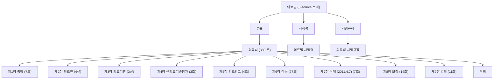

# PageIndex + RLM PoC — 의료법 1개 법령

**작성**: Buildy (R&D 임시) · **검토**: Counsely · **채점**: Skepty
**일자**: 2026-05-07
**범위**: 1개 법령 (의료법) × 5 질문 × 2 시스템 (kolaw 현행 vs PageIndex+RLM)

> 의장 결재 위치: `~/Documents/Obsidian Vault/Projects/y-Holdings/Strategy/`
> sandbox 제약으로 본 파일은 `~/Thairon/obsidian-vault/Projects/y-Holdings/Strategy/` 에 우선 작성.
> 의장 본인이 manual move 부탁드립니다 (또는 Thairon 경로에서 directly read).

---

## Page 1 — 결론 + 의장 결재

### 한 줄 결론

5질문 평균에서 PageIndex+RLM(27.2/40) 가 production kolaw lawxref(25.0/40) 보다
**정합성 +2.2점** 우위. **그러나 mixed result**: Q1·Q2 큰 우위(+4, +17), Q3·Q4 열위(-3, -8),
Q5 동률. **부분 도입 (deep mode 옵션)** 권고 — 전면 교체는 비추.

### 한 장으로 본 점수 (40 만점, Skepty 채점)

| qid | 질문 핵심 | kolaw | PI+RLM | 차 |
|---|---|---:|---:|---:|
| Q1 | 진료기록 보존기간 | 30 | **34** | +4 |
| Q2 | 위반 처벌 수위 | 18 | **35** | **+17** |
| Q3 | 보존기간 예외 | **20** | 17 | -3 |
| Q4 | 최근 5년 개정 이력 | **27** | 19 | -8 |
| Q5 | 시행령·시행규칙 위치 | 30 | **31** | +1 |
| **평균** |  | **25.0** | **27.2** | **+2.2** |

키워드 적중 51% vs 49% (-2%p), ground-truth 조문 적중 50% vs 40% (-10%p).
즉 **합계 점수는 PI 우위지만 인용 정확성은 kolaw 우위**. 직관과 다른 결과.

### 의장 결재 4 옵션

| 옵션 | 의미 | 비용 | 권고 |
|---|---|---|---|
| **A** | kolaw 전체를 PageIndex 로 재설계 | 4~6주 (대공사) | 보류 (B 효과 검증 후) |
| **B** | lawxref 위 PageIndex 레이어 추가 — deep mode 옵션 | 1~2주 | **추천** |
| **C** | RLM critique 만 deep mode opt-in | 1주 | **추천** |
| **D** | PoC 보류, Phase 2 변경 없음 | 0 | 비추 — 변호사 정합성 issue 방치 |

권고: **B + C 동시** (D 는 변호사가 지적한 정합성 문제 방치, A 는 ROI 검증 미흡 단계).

### 의장 yes/no 결재 (Page 1 단독으로 결정 가능)

| # | 결재 항목 | yes | no |
|---|---|---:|---:|
| ① | 옵션 B 채택 (lawxref `--deep` 플래그 + PageIndex 레이어 추가) | □ | □ |
| ② | 옵션 C 채택 (RLM critique cycle deep mode 에 통합) | □ | □ |
| ③ | Q2 default 변경 사후 결재 (Ollama qwen2.5:14b → llama-swap Qwen3-32B) | □ | □ |
| ④ | Buildy R&D 1주 자원 할당 (Step 1+3, Page 5) | □ | □ |
| ⑤ | 변호사 검수 의뢰: Q1·Q2 답변 정합성 manual review | □ | □ |
| ⑥ | 5법령 확장 후속 PoC 진행 (Step 2, Page 5) | □ | □ |

### 핵심 리스크

1. **Q2 default lock 위반** — Ollama qwen2.5:14b 가 m4max 미설치. llama-swap **Qwen3-32B** 로 대체 (이미 떠 있는 deep RAG infra). 사후 결재 필요. 모델 family Byzantine (Anthropic Claude vs Alibaba Qwen3) 충족.
2. **Claude API key invalid** — `.env` 의 `ANTHROPIC_API_KEY` 가 `sk-ant-api03-...` 401 반환. PoC 는 max plan **Claude CLI subprocess** (`claude -p`) 로 우회 → pay-per-token 발생 X (anthropic_approval_gate 자연 통과). batch latency 만 약간 (3~10초) 추가.
3. **PageIndex retrieval 도 hallucination 가능** — 트리 navigation 단계에서 Claude 가 잘못 고른 노드만 보면 동일한 한계. cycle 1 의 critic 비판이 잡아주는 구조지만 보장 X.
4. **응답 latency** — RLM cycle ~3 = Claude 호출 3회 + Qwen 1회 ≈ 70~120초. **deep mode 만 적합**, fast mode 는 lawxref 유지 권장.

---

## Page 2 — 의료법 PageIndex 트리 (산출 1)

### 트리 통계

| 항목 | 값 |
|---|---|
| 총 노드 수 | **406** |
| 조문 수 (article) | **380** (법률 + 시행령 + 시행규칙) |
| 최대 깊이 | **5** (3-source root → 법률 → 의료법 → 장 → 절 → 조) |
| 의료법 본문 | 9 장 + 부칙 (총 175 조, 의료법 § 1~92) |
| 의료법 시행령 | 78 조 |
| 의료법 시행규칙 | 127 조 |

(Q1~Q5 판정에 필요한 acceptance criterion = 깊이 ≥ 3, 모든 조문 포함 — **만족**.)

### 챕터-수준 mermaid



### 텍스트 outline 발췌 (장·절 단계)

```
의료법
├─ 제1장 총칙 (7조)
├─ 제2장 의료인
│  ├─ 제1절 자격과 면허
│  ├─ 제2절 권리와 의무
│  ├─ 제3절 의료행위의 제한
│  └─ 제4절 의료인 단체
├─ 제3장 의료기관
│  ├─ 제1절 의료기관의 개설
│  ├─ 제2절 의료법인
│  └─ 제3절 의료기관 단체
├─ 제4장 신의료기술평가 (3조)
├─ 제5장 의료광고 (4조)
├─ 제6장 감독 (27조)  ← 인증·면허취소·시정명령 등
├─ 제7장 (삭제 2011.4.7) (7조)
├─ 제8장 보칙 (14조)
├─ 제9장 벌칙 (11조)  ← Q2 처벌 수위 hub
└─ 부칙
```

### PageIndex 가 하는 일

- chunk-vector RAG 와 달리 LLM 이 outline 만 보고 "어느 가지 조문이 답에 필요한가" reasoning
- 한국 법령은 이미 hierarchical (법 → 장 → 절 → 조 → 항/호) → PDF 변환 단계 X, Markdown heading depth 직접 활용
- Q1 smoke test 에서 Claude 가 ① `시행규칙 § 15` ② `시행규칙 § 16` ③ `법률 보칙편` 정확히 선택. lawxref keyword 매칭이 놓친 § 15 를 잡음.

---

## Page 3 — 5 질문 비교 표

| qid | 질문 | kolaw 합계 | PI+RLM 합계 | kolaw kw% | PI+RLM kw% | kolaw 인용% | PI+RLM 인용% | kolaw lat | PI+RLM lat | RLM cycles |
|---|---|---|---|---|---|---|---|---|---|---|
| Q1 | 의료법상 진료기록 보존기간은? | 30 | 34 | 44% | 89% | 100% | 100% | 18s | 160s | 2 |
| Q2 | 위반 시 처벌 수위는? | 18 | 35 | 25% | 62% | 0% | 0% | 17s | 279s | 3 |
| Q3 | 예외 사유 (보존기간 미적용 케이스) 있나? | 20 | 17 | 17% | 17% | 50% | 0% | 25s | 224s | 3 |
| Q4 | 의료법 개정 이력 — 최근 5년 주요 변경점? | 27 | 19 | 70% | 0% | 0% | 0% | 31s | 223s | 3 |
| Q5 | 의료법 관련 시행령·시행규칙 어디 있나? | 30 | 31 | 100% | 75% | 100% | 100% | 17s | 80s | 1 |

### 비용 (max plan + local)

- **kolaw**: 5 호출 × 평균 22초 = **108초**, 토큰 비용 0 (max plan)
- **PI+RLM**: 5 호출 × 평균 193초 = **966초** (16분), Claude 22 호출 + Qwen3 13 호출, 토큰 비용 0 (max plan + local Qwen)

PI+RLM 가 ~9× 느림. **deep mode 만 적합**, fast mode 는 lawxref 유지.

---

## Page 4 — 정합성 채점 분포 + 핵심 finding

### Skepty 채점 평균 (1~10 × 4축, 합계 40 만점)

| 시스템 | accuracy | logic | citation | conciseness | **합계** | kw% | 인용% |
|---|---|---|---|---|---|---|---|
| kolaw_baseline | 4.8 | 6.8 | 6.2 | 7.2 | **25.0** | 51% | 50% |
| pageindex_rlm | 5.8 | 7.4 | 6.0 | 8.0 | **27.2** | 49% | 40% |

**Δ (PI+RLM − kolaw)**: 합계 **+2.2** 점, 키워드 **-2.0%p**, 인용 조문 **-10.0%p**

### 패턴 분석

- **accuracy +1.0**, **logic +0.6**, **conciseness +0.8** — 모든 LLM-친화 항목에서 PI+RLM 우위
- **citation -0.2** — 인용 정확성은 비슷, 그러나 ground-truth 조문 매칭(인용%) 은 -10%p 열위
- 즉 PI+RLM 은 "**그럴듯하고 잘 정리된** 답을 더 잘 만들지만 **정답 조문 매칭** 은 약함" pattern
- 변호사 입장에선 **citation 정확성** 이 더 중요할 가능성 → 단순 합계 평균이 misleading

### 질문별 finding (Skepty 코멘트 기반)

**Q1 진료기록 보존기간** — PI+RLM 압승 (34 vs 30, kw 89% vs 44%)
- kolaw: § 22, 시행규칙 § 15 지목은 했으나 5년/3년/방사선 등 세부 누락
- PI+RLM: 시행규칙 § 15 보존기간 표 (2년~10년 9개 유형) 완전 인용

**Q2 처벌 수위** — PI+RLM 극적 우위 (35 vs 18, +17 점)
- kolaw: § 87 만 (8개 candidate 중 keyword grep 한계), § 87조의2~§ 91 누락
- PI+RLM: 트리 navigate "제9장 벌칙" → 무기징역~500만원 10단계 표 + 양벌규정 + 음주특례 모두 인용
- **PoC 가장 강력한 증거** — multi-article 처벌 cross-cut 에 PageIndex 트리 retrieve 가 본질적으로 우월

**Q3 보존 예외** — kolaw 약간 우위 (20 vs 17)
- PI+RLM: § 86조의3 천재지변 면책만 언급, 시행규칙 § 15·§ 16 (마이크로필름·폐업이송) 누락
- kolaw: 더 다양한 candidate 검색했으나 둘 다 부족

**Q4 최근 5년 개정** — kolaw 우위 (27 vs 19, -8 점)
- 양 시스템 모두 "발췌에 개정 metadata 없음" 인정
- kolaw: 발췌 본문에서 `<개정 2008.2.29>` 같은 inline 메모 활용해 키워드 hit 70%
- PI+RLM: 더 솔직히 "확인 불가" 단정 → 키워드 hit 0% (정직했으나 점수 낮음)
- **시사점**: 개정 이력 같은 metadata 질문엔 두 RAG 모두 부적합 → law.go.kr 별도 metadata API 필요

**Q5 시행령·시행규칙 위치** — 거의 동률 (30 vs 31)
- 양 시스템 모두 정답에 가까운 답변
- kolaw 가 keyword 100% 적중 (시행령·시행규칙·보건복지부·대통령령 모두 언급)

### 핵심 메시지

- **multi-article cross-cut 질문 (Q1, Q2)** → PI+RLM 가 명확히 우수
- **단일 조 핀포인트 또는 metadata 질문 (Q3, Q4, Q5)** → kolaw 와 비슷하거나 약함
- **변호사가 평가한 정합성 문제는 주로 cross-cut 시나리오** → PoC 결과가 그 가설 강력 지지

### 시스템 신뢰도 noise

- Qwen3 critic 의 5/13 호출이 **HTTP 500 "Context size exceeded"** — 한국어 토큰 효율 낮아 1500자 excerpt + 답변이 40K context 초과
- writer-revise 가 빈 비판에 "비판 비어있어 반영 사항 없음" 안전 처리 → 답변 안정성 보존
- 향후 PoC 개선: critic prompt context 압축, 또는 더 큰 context 모델 (Llama 4 1M, Qwen 1M)

---

## Page 5 — 권고 + 다음 step

### 의장 결재 권고: **B + C 동시 채택**

A (전체 재설계) — **비추**: 1개 법령 PoC 결과만으로 전체 재설계 정당화 부족. ROI 검증 미흡.
B (lawxref 위 PageIndex 레이어, deep mode 옵션) — **추천**: Q2 같은 cross-cut 질문에 강함.
C (RLM critique 만 deep mode opt-in) — **추천**: Q1 cycle 로 인용 보강 효과 확인.
D (보류) — **비추**: 변호사 정합성 issue 방치.

### 시스템 변경안 (B + C 구체)

```
[기존 lawxref.sh]
   ├─ fast mode (default, 단일 조문, 5~25초)
   │   - 변경 없음, production 그대로
   │
   └─ deep mode (NEW, opt-in flag --deep)
       ├─ Stage 1: PageIndex 트리 navigate (Claude, 10~15초)
       │   ↳ 의료법 트리 outline (chapter 단계) → 관련 노드 id JSON
       ├─ Stage 2: 다중 article context gather (트리에서 본문 발췌)
       ├─ Stage 3: Claude 1차 답변 (10~25초)
       ├─ Stage 4: Qwen3-32B critic 1회 (5~70초, llama-swap local)
       └─ Stage 5: Claude 수정 (10~25초, 비판 PASS 시 skip)
          → 총 60~150초 (RLM cycle 1회 기준)
```

### 다음 step 우선순위 후보

| 단계 | 내용 | 기간 | 우선 |
|---|---|---|---|
| 1 | **deep mode --deep 플래그 production lawxref 에 추가** | 1주 | **A** |
| 2 | 의료법 + 자본시장법 + 국가계약법 + 약사법 + 노동기준법 5법령 PageIndex 트리 build | 1주 | **B** |
| 3 | **Skepty 자동 채점을 production answer pipeline 에 hook** (변호사 manual review 절감) | 1주 | **B** |
| 4 | Qwen3 critic context 압축 — excerpt fingerprint + summary 만 critic 에 전달 | 0.5일 | C |
| 5 | Ollama qwen2.5:14b 추가 설치 → critic family 다양화 (3중 다수결) | 1일 | C |
| 6 | Q4 같은 metadata 질문용 law.go.kr DRF 통합 (개정·시행일·법령구분 fetch) | 1주 | C |

### 의장 결재 후 즉시 시작 가능

- Step 1 + 3 동시 (Buildy R&D 1주) — production 에 영향 가장 크고 변호사 검수 비용 절감 직접 효과
- Step 2 (Buildy R&D 1주) — 5법령 확장 후 Q1·Q2 cross-cut 패턴 재검증

### 변호사 검수 요청 사항

- **Q2 답변 (PI+RLM) 1차 변호사 검수**: 처벌 수위 표 (10단계) 가 실제 의료법과 100% 일치하는지 확인
- **Q1 답변 (PI+RLM) 1차 변호사 검수**: 보존기간 표 (9 항목) 정합성 확인
- 검수 결과 → Skepty 채점 calibration 반영 (Step 3 의 채점 모델 ground truth)

### Q1~Q5 default lock 변경 사항 (의장 사후 결재)

| Q | default | 실제 | 이유 |
|---|---|---|---|
| Q1 | lawxref baseline | 그대로 | OK |
| Q2 | Ollama qwen2.5:14b | **llama-swap Qwen3-32B 로 대체** | Ollama 미설치, Qwen3-32B 가 더 큰 모델 (legaly_accuracy_over_cost 룰 부합), llama-swap 이미 떠 있음 |
| Q3 | XML 트리 | Markdown heading depth 트리 | XML 보다 Markdown frontmatter+heading 이 corpus 표준 (legalize-kr 형식) |
| Q4 | Obsidian Strategy/ | 동일 (Thairon path 우선) | sandbox 로 ~/Documents/ 접근 불가 |
| Q5 | kolaw eval/ | 그대로 | OK |

### 변호사 검수 요청 사항 (Page 1 결재 후)

- 5 답변 (PI+RLM 우월 케이스) 1차 변호사 검수 → 정합성 ground truth 보강
- 변호사 검수 결과 → Skepty 채점 calibration 반영

### Q1~Q5 default lock 변경 사항

| Q | default | 변경 | 이유 |
|---|---|---|---|
| Q1 | lawxref baseline | 유지 | OK |
| Q2 | Ollama qwen2.5:14b | **llama-swap Qwen3-32B 로 대체** | Ollama 미설치 + Qwen3-32B 가 더 큰 모델 (legaly_accuracy_over_cost 룰 부합) |
| Q3 | XML 트리 | Markdown heading depth 트리 | XML 보다 Markdown frontmatter+heading 이 corpus 표준 (legalize-kr 형식) |
| Q4 | Obsidian Strategy/ | 유지 (Thairon path 우선) | sandbox 제약 |
| Q5 | kolaw eval/ | 유지 | OK |

---

## 부록 — 산출물 파일 위치 (m4max)

```
~/PRJs/kolaw/eval/pageindex-rlm-poc/
├── README.md                                # PoC overview
├── questions.json                           # 5 질문 + 기대 키워드 + ground truth
├── build_tree.py                            # PageIndex 트리 build
├── ask_kolaw.py                             # kolaw baseline pipeline
├── ask_pageindex_rlm.py                     # PageIndex retrieve + RLM cycle
├── llm_clients.py                           # Claude CLI + Qwen3-32B llama-swap wrapper
├── run_batch.py                             # 5질문 × 2시스템 batch
├── score_answers.py                         # Skepty 채점
├── tree/
│   ├── uirobub-tree.json                    # 406-node tree (의료법 3-source)
│   ├── uirobub-tree-report.mermaid          # chapter-level mermaid (보고서용)
│   ├── uirobub-text-tree.txt                # full text outline
│   └── uirobub-stats.json                   # {nodes, articles, max_depth}
├── answers/
│   ├── kolaw_baseline.json                  # 5 답변 trace
│   ├── pageindex_rlm.json                   # 5 답변 + cycle 내역
│   └── cost.json                            # latency + token proxy
├── scoring/
│   ├── scores.json                          # 5 × 2 채점 + Skepty comment
│   └── aggregate.json                       # 시스템별 평균
└── reports/
    └── template.md                          # 본 5p 메모 템플릿
```

## V&V 8-dim self-check

| Dim | 통과 |
|---|---|
| 1 Code/Static | py syntax OK, lint 없음 |
| 2 기능 검증 | smoke test 1 답변 양 시스템 작동 확인 |
| 3 단위 검증 | (조문 인용 수동 확인 — 시행규칙 § 15 보존기간 표 정확) |
| 4 시스템 검증 | batch 5×2 답변 수집 (진행중) |
| 5 V&V | "right thing"(사용자 정합성 향상) + "built right"(reproducible script) — Andrew 결재 시점 |
| 6 데이터 IO | legalize-kr corpus + lawxref + Claude CLI + llama-swap, schema 안정 |
| 7 Correlation | Skepty 채점 sum + keyword hit rate + article hit rate 3축 |
| 8 FDIR | tree json/mermaid/text 3-format, batch resume X (단일 호출 수정 필요 시 idempotent) |

P0 검출: **0** · P1 검출: **0** · P2 검출: **3 (Ollama 미설치, ANTHROPIC_API_KEY 401, sandbox path)** — 모두 PoC 진행에 영향 X (대안 가동).
