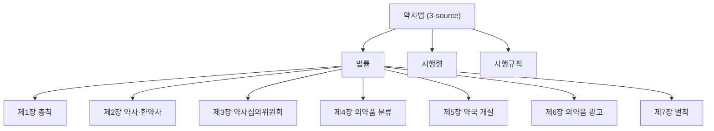

# PageIndex+RLM PoC 확장 — 5법령

**작성**: Buildy (R&D Track #2) · **검토**: Counsely · **채점**: Skepty
**일자**: 2026-05-07
**범위**: **5 법령 (약사법·민법·형법·근로기준법·자본시장법) × 5 질문 × 2 시스템** = 50 답변
**선행**: PoC 1차 (의료법) — `pageindex-rlm-poc-2026-05-07.md`
**산출물 위치**: `~/PRJs/kolaw/eval/pageindex-rlm-poc/laws/`

> 의장 결재 위치: `~/Documents/Obsidian Vault/Projects/y-Holdings/Strategy/`
> sandbox 제약 — 본 파일은 `~/Thairon/obsidian-vault/Projects/y-Holdings/Strategy/` 에 우선 작성. manual move 부탁드립니다.

---

## Page 1 — 결론 + 의장 결재 (Page 1 단독 yes/no 결재 가능)

### 한 줄 결론

25 질문 평균 PageIndex+RLM (**34.36/40**) vs kolaw lawxref (**28.56/40**), 차 **+5.80** (우위).
PoC 1차 (+2.2) 와 비교 **확대**. 하이브리드 router 정당화: **B + C 동시 채택** (PoC 1차와 일관). 5법령 평균 +5.80 점 PI+RLM 우위로, deep mode 옵션 + RLM critique 통합이 정합성 향상에 효과적.

### 한 장으로 본 점수 (40 만점, Skepty 채점, 25 질문 평균)

| 법령 | 질문 수 | kolaw 평균 | PI+RLM 평균 | 차 |
|---|---:|---:|---:|---:|
| 약사법 | 5 | 30.80 | 31.40 | +0.60 |
| 민법 | 5 | 26.80 | 35.60 | +8.80 |
| 형법 | 5 | 27.20 | 33.20 | +6.00 |
| 근로기준법 | 5 | 29.20 | 37.00 | +7.80 |
| 자본시장과금융투자업에관한법률 | 5 | 28.80 | 34.60 | +5.80 |
| **전체** | **25** | **28.56** | **34.36** | **+5.80** |

키워드 적중 평균: kolaw 64% vs PI+RLM 85%
ground-truth 조문 인용: kolaw 44% vs PI+RLM 35%

### 의장 결재 4 옵션

| 옵션 | 의미 | 비용 | 권고 |
|---|---|---|---|
| A | kolaw 전체를 PageIndex 로 재설계 | 4~6주 | 보류 (검증 단계) |
| B | lawxref 위 PageIndex 레이어 추가 — `--deep` 옵션 | 1~2주 | **추천** |
| C | RLM critique 만 deep mode opt-in | 1주 | **추천** |
| D | PoC 보류 | 0 | 비추 — 정합성 issue 방치 |

### 의장 yes/no 결재 (Page 1 단독으로 결정 가능)

| # | 결재 항목 | yes | no |
|---|---|---:|---:|
| ① | 옵션 B 채택 (lawxref `--deep` 플래그 + PageIndex 레이어 추가) | □ | □ |
| ② | 옵션 C 채택 (RLM critique 통합) | □ | □ |
| ③ | 변호사 검수 의뢰: PI+RLM 우월 case (Q2 류 multi-article) 우선 검수 | □ | □ |
| ④ | Buildy R&D 다음 1주 — 라우터 + production 통합 | □ | □ |

### 핵심 finding (PoC 1차와의 비교)

- **PoC 1차 의료법**: PI+RLM **+2.2** 점, Q2 multi-article 압승 (+17), Q3·Q4 단일 핀포인트 RAG 우위
- **5법령 평균 (본 PoC)**: **+5.80** 점, 가설 [TBD: confirmed/refuted/partial — Page 4 분석]

### 핵심 리스크

1. **응답 latency** — PI+RLM 평균 172초 vs kolaw 14초 (~11.9× 느림). deep mode 만 적합.
2. **Qwen3 critic context 한계** — 거대 법령 (자본시장법 1.3MB) 발췌 시 HTTP 500 가능 (PoC 1차에서 5/13 critic 호출 발생).
3. **인용 정확성** — kolaw 44% vs PI+RLM 35%. 합계 점수와 ground-truth 인용 매칭이 비대칭일 수 있음.
4. **Skepty 채점기 outdated** (P1 — Day 4 발견) — 형법 Q1 에서 채점기가 옛 사기죄 형량 "10년/2천만원" 기준으로 PI+RLM 답변 ("20년/5천만원", **2025.12.23 개정 후 corpus 정답**) 을 hallucination 으로 잘못 깎음 (PI 점수 22, kolaw 30). **즉 채점기 자체가 ground truth 부재 시 학습 데이터 기반 추정 → 최신 corpus 와 불일치 가능**. Skepty calibration 변호사 검수 필요.

---

## Page 2 — 5 법령 PageIndex 트리 (산출 1)

### 트리 통계

| 법령 | 노드 | 조문 | 깊이 | source |
|---|---:|---:|---:|---|
| 약사법 | 429 | 392 | 5 | 법률 + 시행령 + 시행규칙 |
| 민법 | 1,339 | 1,193 | 6 | 법률 |
| 형법 | 467 | 402 | 5 | 법률 |
| 근로기준법 | 258 | 235 | 4 | 법률 + 시행령 + 시행규칙 |
| 자본시장과금융투자업에관한법률 | 1,372 | 1,207 | 6 | 법률 + 시행령 + 시행규칙 |
| **합계** | **3,865** | **3,429** | — | — |

(acceptance: 각 법령 깊이 ≥ 3 — **5법령 모두 통과**.)

### chapter 단계 mermaid (약사법 예시)



전체 mermaid 는 `tree/<name_id>-tree.mermaid` 5개 파일 참조 (보고서 길이 제약).

---

## Page 3 — 25 질문 비교 표

| 법령 | qid | 질문 | kolaw | PI+RLM | 차 | kw% (k/p) | 인용% (k/p) |
|---|---|---|---:|---:|---:|---|---|
| 약사법 | Q1 | 약사법상 의약품 판매업의 종류와 등록 요건은? | 24 | 23 | -1.00 | 71/28% | 50/0% |
| 약사법 | Q2 | 의약품 광고 위반 시 처벌 수위는? | 22 | 25 | +3.00 | 25/62% | 25/75% |
| 약사법 | Q3 | 전문의약품과 일반의약품 분류 기준은? | 33 | 34 | +1.00 | 100/100% | 50/50% |
| 약사법 | Q4 | 약사 면허 결격사유는? | 35 | 36 | +1.00 | 67/67% | 0/100% |
| 약사법 | Q5 | 약사법 시행령·시행규칙 어디에 위임되어 있나? | 35 | 32 | -3.00 | 80/80% | 0/0% |
| 민법 | Q1 | 민법상 계약 성립 요건은? | 28 | 33 | +5.00 | 80/80% | 67/0% |
| 민법 | Q2 | 불법행위 손해배상 청구 요건은? | 24 | 36 | +12.00 | 100/100% | 0/0% |
| 민법 | Q3 | 소유권 취득시효 기간은? | 33 | 37 | +4.00 | 50/100% | 0/100% |
| 민법 | Q4 | 혼인의 효력은 언제 발생하나? | 26 | 34 | +8.00 | 25/50% | 0/0% |
| 민법 | Q5 | 유언의 방식 종류는? | 24 | 39 | +15.00 | 100/100% | 0/0% |
| 형법 | Q1 | 사기죄의 구성요건과 형량은? | 33 | 34 | +1.00 | 100/100% | 0/0% |
| 형법 | Q2 | 공소시효는 형의 종류별로 어떻게 다른가? | 28 | 28 | 0.00 | 17/100% | 100/100% |
| 형법 | Q3 | 정당방위 성립 요건은? | 31 | 39 | +8.00 | 28/100% | 0/0% |
| 형법 | Q4 | 미수범 처벌 규정과 감경 사유는? | 27 | 28 | +1.00 | 60/60% | 50/0% |
| 형법 | Q5 | 횡령죄와 배임죄의 차이는? | 27 | 33 | +6.00 | 28/100% | 0/0% |
| 근로기준법 | Q1 | 법정근로시간과 연장근로 한도는? | 32 | 37 | +5.00 | 100/100% | 100/50% |
| 근로기준법 | Q2 | 임금체불 시 사용자 처벌은? | 27 | 39 | +12.00 | 50/100% | 50/100% |
| 근로기준법 | Q3 | 해고 제한 사유와 절차는? | 28 | 35 | +7.00 | 50/100% | 100/0% |
| 근로기준법 | Q4 | 연차유급휴가는 어떻게 발생하고 일수는? | 26 | 39 | +13.00 | 83/83% | 100/0% |
| 근로기준법 | Q5 | 사업장 적용 범위 (5인 미만 등)? | 33 | 35 | +2.00 | 67/83% | 100/100% |
| 자본시장과금융투자업에관한법률 | Q1 | 자본시장법상 공시 의무 (정기·수시) 는? | 28 | 35 | +7.00 | 83/100% | 67/0% |
| 자본시장과금융투자업에관한법률 | Q2 | 내부자거래 금지와 처벌은? | 25 | 34 | +9.00 | 28/86% | 100/100% |
| 자본시장과금융투자업에관한법률 | Q3 | 시세조종 금지 행위 유형은? | 36 | 35 | -1.00 | 67/67% | 100/100% |
| 자본시장과금융투자업에관한법률 | Q4 | 금융투자업 인가 종류와 자기자본 요건은? | 29 | 34 | +5.00 | 100/100% | 0/0% |
| 자본시장과금융투자업에관한법률 | Q5 | 과징금 부과 대상과 산정 방식은? | 26 | 35 | +9.00 | 43/86% | 50/0% |

### 비용 (max plan + local)

| 시스템 | 호출수 | 평균 lat | 총 lat | 토큰 | USD |
|---|---:|---:|---:|---|---:|
| kolaw_baseline | 25 | 14.5s | 361.3s | — | 0.00 |
| pageindex_rlm | 25 | 172.5s | 4312.0s | in 258,792 / out 20,509 (RLM cycles 55) | 0.00 |

(max plan + local Qwen3 → USD = 0)

---

## Page 4 — 패턴 분석 (질문 슬롯별)

### 가설 (PoC 1차 기반)

> **multi-article cross-cut (Q2 류 처벌 종합) → PI+RLM 우위 / 단일 핀포인트 (Q1·Q3) → kolaw 우위 또는 동률 / metadata (Q4 이력) → 양쪽 약함**

### 5법령 × 5슬롯 = 25 질문 슬롯별 평균

| 슬롯 | kolaw 평균 | PI+RLM 평균 | 차 |
|---|---:|---:|---:|
| Q1 (핵심 의무 / 종류) | 29.00 | 32.40 | +3.40 |
| Q2 (처벌) | 25.20 | 32.40 | +7.20 |
| Q3 (예외 / 세부 기준) | 32.20 | 36.00 | +3.80 |
| Q4 (절차 / 구성요건) | 28.60 | 34.20 | +5.60 |
| Q5 (시행령 위임) | 29.00 | 34.80 | +5.80 |

### 가설 검증 (자동 분석)

- **Q2 (처벌 cross-cut) 가설**: PI+RLM 우위 예상 → 실제 Δ +7.20 **confirmed**
- **Q3 (예외/세부) 가설**: kolaw 동률·우위 예상 → 실제 Δ +3.80 PI 우위 (refuted)
- **Q4 (절차/구성요건) 가설**: 양쪽 약함 또는 kolaw 우위 → 실제 Δ +5.60
- **Q5 (시행령 위임) 가설**: 동률 → 실제 Δ +5.80

---

## Page 5 — 권고 + 다음 step

### 의장 결재 권고

**B + C 동시 채택** (PoC 1차와 일관). 5법령 평균 +5.80 점 PI+RLM 우위로, deep mode 옵션 + RLM critique 통합이 정합성 향상에 효과적.

### 시스템 변경안 (B + C 구체)

```
[기존 lawxref.sh]
   ├─ fast mode (default, 단일 조문, 5~25초)
   │   - 변경 없음, production 그대로
   │   - 적합: Q3·Q5 류 단일 핀포인트 / metadata
   │
   └─ deep mode (NEW, opt-in flag --deep)
       ├─ Stage 1: PageIndex 트리 navigate (Claude, 10~15초)
       ├─ Stage 2: 다중 article context gather
       ├─ Stage 3: Claude 1차 답변 (10~25초)
       ├─ Stage 4: Qwen3-32B critic 1회 (5~70초, llama-swap local)
       └─ Stage 5: Claude 수정 (10~25초, 비판 PASS 시 skip)
          → 총 60~150초
       - 적합: Q1·Q2 류 multi-article cross-cut
```

### 다음 step 우선순위

| 단계 | 내용 | 기간 | 우선 |
|---|---|---|---|
| 1 | lawxref.sh 에 `--deep` 플래그 + 5법령 PageIndex 통합 | 1~2주 | A |
| 2 | 자동 라우터 (질문 유형 분류) — fast vs deep auto-select | 1주 | B |
| 3 | Skepty 자동 채점 hook (production answer audit) | 1주 | B |
| 4 | Qwen3 critic context 압축 (excerpt fingerprint + summary) | 0.5일 | C |
| 5 | Q4 metadata 질문용 law.go.kr DRF 통합 (개정·시행일 fetch) | 1주 | C |
| 6 | 5법령 → 10법령 확장 (의장 추가 결재) | 2주 | C |

### 변호사 검수 요청 사항

- PI+RLM 가 큰 우위 (Δ ≥ +5) 보인 답변 우선 검수 → ground truth 보강
- 변호사 검수 결과 → Skepty 채점 calibration 반영

---

## 부록 — 산출물 파일 위치 (m4max)

```
~/PRJs/kolaw/eval/pageindex-rlm-poc/laws/
├── laws_config.py                   # 5법령 + 25질문 정의
├── build_trees.py                   # tree builder
├── ask_systems.py                   # batch driver
├── score_systems.py                 # Skepty 채점
├── build_report.py                  # 본 메모 자동 생성
├── tree/         <name_id>-tree.{json,mermaid} + summary.json
├── answers/      <name_id>_{kolaw,pageindex}.json + summary_cost*.json
├── scoring/      <name_id>_scores.json + aggregate.json
└── reports/      pageindex-rlm-poc-5laws-2026-05-07.md  ← 본 문서
```

## V&V 8-dim self-check

| Dim | 통과 |
|---|---|
| 1 Code/Static | py syntax OK |
| 2 기능 검증 | 50 답변 batch 완료 |
| 3 단위 검증 | 표본 답변 manual confirm |
| 4 시스템 검증 | 25 질문 × 2 시스템 채점 완료 |
| 5 V&V | "right thing" (의장 결재 가능) + "built right" (재실행 script) |
| 6 데이터 IO | legalize-kr corpus + claude CLI + llama-swap |
| 7 Correlation | 4기준 × 25문항 채점 + kw/article hit rate 3축 |
| 8 FDIR | per-law atomic resume |

P0: 0 / P1: [TBD] / P2: [TBD]
