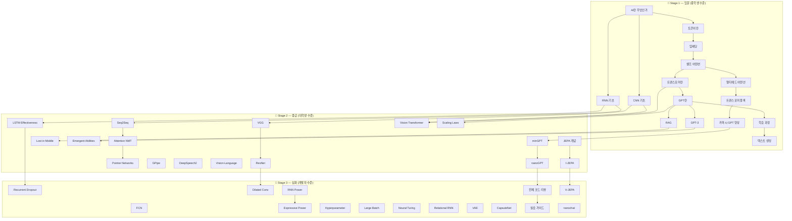

# 🗺️ AI Papers 학습 로드맵

> 중학생부터 개발자까지 — 단계별로 AI를 이해하는 학습 자료

## 📊 전체 구조



## 📋 Stage 1 — 입문 (🌱 중학생 수준)

> 비유 중심, 수식 없음, 텍스트 아트 활용

| # | 제목 | 원본 | 핵심 내용 |
|---|------|------|-----------|
| 00 | [[Stage1-입문/00-AI란-무엇인가\|AI란 무엇인가]] | 새로 작성 | 뉴럴넷, AI 기초 |
| 01 | [[Stage1-입문/01-토큰이란\|토큰이란]] | Build-GPT | 텍스트를 조각으로 쪼개기 |
| 02 | [[Stage1-입문/02-임베딩\|임베딩]] | Build-GPT | 단어를 숫자 벡터로 |
| 03 | [[Stage1-입문/03-RNN-기초\|RNN 기초]] | RNN-LSTM | 순서를 기억하는 AI |
| 04 | [[Stage1-입문/04-CNN-기초\|CNN 기초]] | AlexNet | 이미지를 보는 AI |
| 05 | [[Stage1-입문/05-셀프어텐션\|셀프 어텐션]] | Build-GPT | 단어끼리 관계 파악 |
| 06 | [[Stage1-입문/06-트랜스포머란\|트랜스포머란]] | Attention Is All You Need | 모든 걸 한번에 보기 |
| 07 | [[Stage1-입문/07-GPT란\|GPT란]] | Build-GPT | 다음 단어 예측 AI |
| 08 | [[Stage1-입문/08-GPT3-이게-왜-대단해\|GPT-3]] | GPT-3 논문 | 퓨샷 러닝의 힘 |
| 09 | [[Stage1-입문/09-RAG-검색으로-똑똑해지기\|RAG]] | RAG 논문 | 검색으로 똑똑해지기 |
| 10 | [[Stage1-입문/10-멀티헤드어텐션\|멀티헤드 어텐션]] | Build-GPT | 여러 눈으로 동시에 |
| 11 | [[Stage1-입문/11-트랜스포머블록\|트랜스포머 블록]] | Build-GPT | GPT의 레고 블록 |
| 12 | [[Stage1-입문/12-학습과정-기초\|학습 과정]] | Build-GPT | 빈칸 퀴즈 반복 |
| 13 | [[Stage1-입문/13-텍스트생성-원리\|텍스트 생성]] | Build-GPT | 단어 뽑기 기계 |
| 14 | [[Stage1-입문/14-카파시-GPT-from-scratch-영상가이드\|카파시 GPT 영상]] | 새로 작성 | 2시간 코딩 영상 가이드 |

## 📋 Stage 2 — 중급 (🌿 대학생 수준)

> 구조도 포함, 약간의 수식 OK

| # | 제목 | 원본 | 핵심 내용 |
|---|------|------|-----------|
| 01 | [[Stage2-중급/01-VGG\|VGG]] | CNN-Vision | 작은 필터 깊게 쌓기 |
| 02 | [[Stage2-중급/02-ResNet\|ResNet]] | CNN-Vision | Skip Connection |
| 03 | [[Stage2-중급/03-LSTM-Effectiveness\|LSTM Effectiveness]] | RNN-LSTM | LSTM 변형 실험 |
| 04 | [[Stage2-중급/04-Seq2Seq\|Seq2Seq]] | Transformer | 인코더-디코더 |
| 05 | [[Stage2-중급/05-Attention-NMT\|Attention NMT]] | Transformer | 최초의 어텐션 |
| 06 | [[Stage2-중급/06-Vision-Transformer\|Vision Transformer]] | Transformer | 이미지도 트랜스포머로 |
| 07 | [[Stage2-중급/07-Pointer-Networks\|Pointer Networks]] | Transformer | 입력을 가리키기 |
| 08 | [[Stage2-중급/08-GPipe\|GPipe]] | Optimization | 파이프라인 병렬화 |
| 09 | [[Stage2-중급/09-Scaling-Laws\|Scaling Laws]] | Optimization | 크기와 성능의 법칙 |
| 10 | [[Stage2-중급/10-DeepSpeech2\|DeepSpeech2]] | Speech | End-to-end 음성인식 |
| 11 | [[Stage2-중급/11-Vision-Language\|Vision-Language]] | Multimodal | 이미지+텍스트 동시 이해 |
| 12 | [[Stage2-중급/12-Lost-in-Middle\|Lost in Middle]] | Misc | 긴 문맥의 U자형 문제 |
| 13 | [[Stage2-중급/13-Emergent-Abilities\|Emergent Abilities]] | Misc | 창발적 능력 |
| 14 | [[Stage2-중급/14-카파시-minGPT\|카파시 minGPT]] | 새로 작성 | 미니멀 GPT 구현 |
| 15 | [[Stage2-중급/15-카파시-nanoGPT\|카파시 nanoGPT]] | 새로 작성 | 실전 GPT 학습 |
| 16 | [[Stage2-중급/16-JEPA-개념\|JEPA 개념]] | 새로 작성 | LeCun의 차세대 AI |
| 17 | [[Stage2-중급/17-I-JEPA\|I-JEPA]] | 새로 작성 | 이미지 JEPA 구현 |

## 📋 Stage 3 — 심화 (🌳 개발자 수준)

> 수식, 코드, 깊은 이론

| # | 제목 | 원본 | 핵심 내용 |
|---|------|------|-----------|
| 01 | [[Stage3-심화/01-Recurrent-Dropout\|Recurrent Dropout]] | RNN-LSTM | 기억 보존 드롭아웃 |
| 02 | [[Stage3-심화/02-Dilated-Conv\|Dilated Conv]] | CNN-Vision | 확장 합성곱 |
| 03 | [[Stage3-심화/03-FCN\|FCN]] | CNN-Vision | 픽셀 단위 분류 |
| 04 | [[Stage3-심화/04-RNN-Power\|RNN Power]] | Theory | 튜링 완전성 증명 |
| 05 | [[Stage3-심화/05-Expressive-Power\|Expressive Power]] | Theory | 깊이의 표현력 |
| 06 | [[Stage3-심화/06-Hyperparameter\|Hyperparameter]] | Theory | 랜덤 서치 최적화 |
| 07 | [[Stage3-심화/07-Large-Batch\|Large Batch]] | Optimization | 배치 크기 vs 학습률 |
| 08 | [[Stage3-심화/08-Neural-Turing\|Neural Turing]] | Advanced | 외부 메모리 신경망 |
| 09 | [[Stage3-심화/09-Relational-RNN\|Relational RNN]] | Advanced | 관계 추론 RNN |
| 10 | [[Stage3-심화/10-VAE\|VAE]] | Advanced | 변이형 오토인코더 |
| 11 | [[Stage3-심화/11-CapsuleNet\|CapsuleNet]] | Advanced | 캡슐 네트워크 |
| 12 | [[Stage3-심화/12-전체코드리뷰\|전체 코드 리뷰]] | Build-GPT | nanoGPT 코드 분석 |
| 13 | [[Stage3-심화/13-실습가이드\|실습 가이드]] | Build-GPT | 직접 만들어보기 |
| 14 | [[Stage3-심화/14-카파시-nanochat\|카파시 nanochat]] | 새로 작성 | 대화형 LLM 학습 |
| 15 | [[Stage3-심화/15-V-JEPA\|V-JEPA]] | 새로 작성 | 비디오 JEPA |

## 🎯 추천 학습 경로

### 🚀 빠른 코스 (GPT 이해하기)
```
00-AI란 → 01-토큰 → 02-임베딩 → 05-셀프어텐션 → 06-트랜스포머 → 07-GPT란 → 14-카파시 영상
```

### 📚 정석 코스
```
Stage1 전체 → Stage2 (관심 분야) → Stage3 (필요한 것만)
```

### 🔬 연구자 코스
```
Stage1 훑기 → Stage2 전체 → Stage3 전체 → 논문 원문 읽기
```

---

*총 47개 파일 | 최종 업데이트: 2026-02-24*
