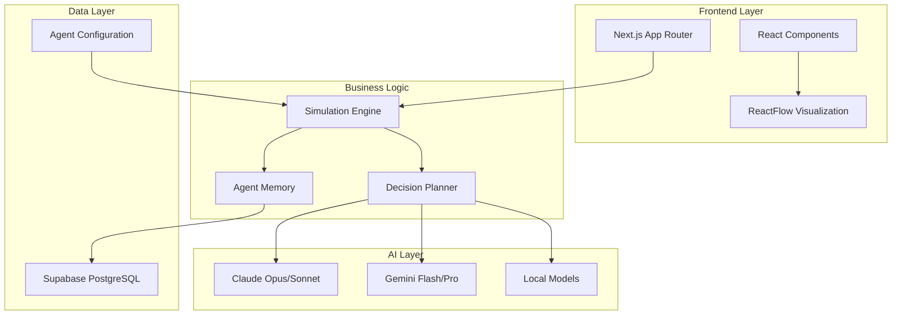

# _y Holdings — AI Company Simulator

> 30 AI agents. 10 floors. Your company, analyzed in real-time.


## What is this?

_y Holdings is an AI company simulator where 30 specialized AI agents operate a virtual company. Connect your website and watch agents analyze your business in real-time — from SEO to security, marketing to infrastructure.

Each agent has its own personality, role, and specialized LLM model, creating realistic inter-departmental dynamics and comprehensive business analysis.

## Features

### 🔍 2-Stage Company Analysis
- **Phase 1**: Counsely (Chief Strategist) scans your URL and classifies your business type
- **Phase 2**: 7-8 specialized agents are dynamically selected and analyze your company
- Watch each agent's progress in real-time (Agent Chain of Thought)

### 🏢 10-Floor Virtual Tower
- Each floor houses a different department (Strategy, Security, Engineering, Marketing, etc.)
- Click any floor to see the agents working inside
- Agent status simulation — watch who's working, idle, or resting

### ⚔️ War Room
- Run meetings with your AI team on any topic
- Choose from scenario presets (Market Crisis, Product Launch, Security Breach)
- Or type your own agenda — agents discuss and debate

### 📊 Chairman Dashboard
- Approve/reject decisions from your AI team
- View reports from each agent
- Timeline of all company activity

### 🔗 Company Connection
- Connect your real company URL
- Agents provide tailored analysis and recommendations
- Re-scan anytime from Company Settings

### 🌍 Bilingual Support
- Toggle between English and Korean (한국어) with the language switcher
- All UI text supports both languages

## Tech Stack

- **Frontend**: Next.js 16, React 19, TypeScript, Tailwind CSS
- **UI Components**: shadcn/ui, Lucide Icons, ReactFlow
- **Backend**: Supabase (PostgreSQL), Next.js API Routes
- **AI Models**: Claude (Anthropic), Gemini (Google), DeepSeek R1, Qwen3, MiniMax M2.5 via Ollama
- **Deployment**: Vercel

## Quick Start

### Prerequisites
- Node.js 18+
- Supabase account (free tier works)
- Optional: AI API keys (Gemini, Anthropic) for enhanced features

### Setup

1. Clone the repository
```bash
git clone https://github.com/antryu2b/y-company.git
cd y-company
```

2. Install dependencies
```bash
npm install
```

3. Copy environment variables
```bash
cp .env.example .env.local
```

4. Configure your `.env.local` with:
   - Supabase credentials (required)
   - Gemini API key (optional)
   - Anthropic API key (optional)

5. Run development server
```bash
npm run dev
```

6. Open [http://localhost:3000](http://localhost:3000)

## Architecture



### Project Structure

```
src/
├── app/           # Next.js App Router pages & API routes
├── components/    # React components
│   ├── TowerView.tsx        # Main tower visualization
│   ├── CompanySettings.tsx  # Company connection & profile
│   ├── MeetingRoom.tsx      # War Room (meetings + simulations)
│   ├── ChairmanDashboard.tsx # CEO dashboard
│   ├── AgentFlowGraph.tsx   # Agent workflow visualization
│   └── ...
├── data/          # Agent configs, floor data, i18n
├── engine/        # Simulation engine, memory, planner
├── lib/           # Utilities, Supabase client, connectors
├── context/       # React contexts (Language, Report)
└── hooks/         # Custom React hooks
```

## The 30 Agents

Our AI workforce is organized across 10 floors with clear hierarchies and specialized roles:

| # | Agent | Role | Floor | Department | LLM |
|---|-------|------|-------|------------|-----|
| 30 | Counsely | Chief of Staff | 10F | Chairman's Office | Claude Opus |
| 01 | Tasky | Task Management | 9F | Planning & Coordination | Claude Opus |
| 02 | Finy | Financial Planning | 9F | Planning & Coordination | DeepSeek R1 |
| 03 | Legaly | Legal Affairs | 9F | Planning & Coordination | Qwen3 32B |
| 04 | Skepty | Risk Analysis | 8F | Risk Challenge | DeepSeek R1 |
| 05 | Audity | Auditing | 8F | Audit | DeepSeek R1 |
| 06 | Pixely | UI/UX Design | 7F | Software Development | Gemini Flash |
| 07 | Buildy | Full-stack Development | 7F | Software Development | MiniMax M2.5 |
| 08 | Testy | QA/Testing | 7F | Software Development | MiniMax M2.5 |
| 09 | Buzzy | Social Media | 6F | Content Division | Claude Sonnet |
| 10 | Wordy | Copywriting | 6F | Content Division | Claude Sonnet |
| 11 | Edity | Video Editing | 6F | Content Division | Gemini Flash |
| 12 | Searchy | SEO/Research | 6F | Content Division | Gemini Flash |
| 13 | Growthy | Growth Hacking | 5F | Marketing Division | Qwen3 32B |
| 14 | Logoy | Brand Design | 5F | Marketing Division | Gemini Flash |
| 15 | Helpy | Customer Support | 5F | Marketing Division | Gemini Flash |
| 16 | Clicky | Ad Management | 5F | Marketing Division | Gemini Flash |
| 17 | Selly | Sales Strategy | 5F | Marketing Division | Gemini Flash |
| 18 | Stacky | Infrastructure | 4F | ICT Division | MiniMax M2.5 |
| 19 | Watchy | Monitoring | 4F | ICT Division | Claude Sonnet |
| 20 | Guardy | Security | 4F | ICT Division | DeepSeek R1 |
| 21 | Hiry | Operations Support | 3F | Human Resources | Qwen3 32B |
| 22 | Evaly | Data Analytics | 3F | Human Resources | Claude Sonnet |
| 23 | Quanty | Quantitative Analysis | 2F | _y Capital | DeepSeek R1 |
| 24 | Tradey | Trading | 2F | _y Capital | Qwen3 32B |
| 25 | Globy | Global Markets | 2F | _y Capital | Gemini Flash |
| 26 | Fieldy | Field Research | 2F | _y Capital | Gemini Flash |
| 27 | Hedgy | Hedge Strategy | 2F | _y Capital | DeepSeek R1 |
| 28 | Valuey | Valuation | 2F | _y Capital | DeepSeek R1 |
| 29 | Opsy | Operations | 1F | _y SaaS | Qwen3 32B |

### LLM Distribution Strategy

Different AI models are strategically assigned based on the **Byzantine Principle** — conflicting positions must use different LLMs to ensure diverse perspectives:

- **Claude Opus**: C-Suite strategic decisions
- **DeepSeek R1**: Risk analysis and auditing (counter-perspective)
- **Claude Sonnet**: Creative content and communications
- **Qwen3 32B**: Specialized analysis and management
- **Gemini Flash**: Rapid execution and data processing
- **MiniMax M2.5**: Technical development and infrastructure

## Configuration

Company settings can be customized in `src/data/company-config.ts`:
- Company name and description
- Products and services
- Target customers
- Company values and principles
- Agent response rules

## Development

### Available Scripts

```bash
npm run dev          # Start development server
npm run build        # Build for production
npm run start        # Start production server
npm run lint         # Run ESLint
npm run chat-worker  # Start chat worker for agent interactions
```

### Adding New Agents

1. Update `src/data/agent-config.ts` with new agent configuration
2. Assign appropriate LLM model and department
3. Update floor layouts in `src/data/floor-config.ts`

## Deployment

The easiest way to deploy is using Vercel:

[](https://vercel.com/new/clone?repository-url=https%3A%2F%2Fgithub.com%2Fantryu2b%2Fy-company)

1. Connect your GitHub repository to Vercel
2. Set environment variables in Vercel dashboard
3. Deploy automatically on every push to main

## License

AGPL-3.0 — see [LICENSE](./LICENSE)

This project is open source under the GNU Affero General Public License v3.0. You are free to use, modify, and distribute this software, but any modifications must also be open sourced under the same license.

## Links

- 🌐 [Live Demo](https://y-company-sigma.vercel.app)
- 🐦 [Twitter/X](https://x.com/_yholdings)
- 📧 Contact: [Your Contact Information]

---

*Built with ❤️ by the _y Holdings development team*